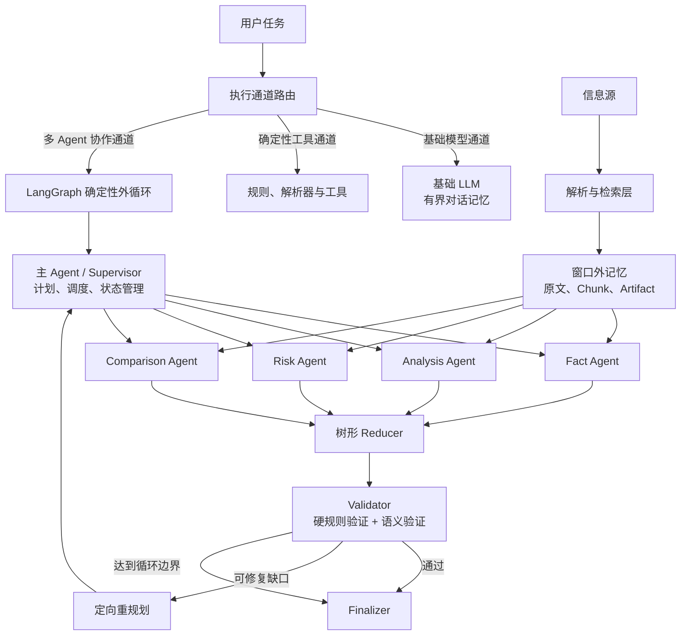

# Context Atlas

> 基于 LangGraph 的确定性多 Agent 系统，让固定上下文窗口的模型能够处理总体规模更大的复杂任务。

Context Atlas 建立在 OpenAI Chat Completions 兼容模型之上，采用主 Agent 统一调度、专业子 Agent 隔离执行、窗口外记忆、树形归并和 Validator 验证，在不修改底层模型的前提下扩展应用层任务容量。

系统突破的是**整体任务规模**，不是模型单次调用的物理上下文窗口。每次模型调用仍严格保持在原始限制以内。

## 为什么需要 Context Atlas

普通 Agent 往往把系统提示、对话历史、检索内容、工具结果和中间输出持续追加到同一个上下文：

```text
Context(t)
= System Prompt
+ Conversation History
+ Retrieved Content
+ Tool Results
+ Intermediate Outputs
```

随着任务持续执行，上下文会不断增长。达到模型上限后，系统只能截断信息、压缩历史或者终止请求。多个 Agent 如果继续共享同一条对话历史，也只会让上下文增长得更快。

Context Atlas 使用另一种协作方式：

```text
大型任务
→ 任务拆分
→ 有界检索
→ 专业 Agent 独立执行
→ 分层归并
→ 结果验证
```

原始资料和中间产物保存在模型窗口之外。Agent 只接收当前子任务需要的证据，并通过结构化结果、Artifact ID 和任务状态进行协作。

## 核心能力

| 能力 | 说明 |
|---|---|
| 基础模型能力 | 保留底层模型原有的理解、生成和推理能力 |
| 资料处理 | 将不同来源和格式的内容转换为统一的信息结构 |
| 长上下文任务 | 通过分块、检索、分治和归并处理大规模信息 |
| 多 Agent 协作 | 由主 Agent 调度职责独立的专业 Agent |
| 外部信息检索 | 将外部来源转换为受控证据参与任务处理 |
| 证据追踪 | 使用证据标识连接原始资料、中间产物和最终结果 |
| 质量验证 | 对结构、引用、完整性、冲突和语义一致性进行检查 |
| 容量治理 | 根据任务和资料规模自动分配 Agent，并为调用、分片和中间产物设置独立预算 |
| 来源可观察性 | 展示来源文件、索引文本、证据块的字节大小及其分片归属 |

## 工作原理



### 三条执行通道

系统根据任务复杂度、数据依赖和结果约束选择执行方式。

| 通道 | 适用范围 | 执行方式 |
|---|---|---|
| 基础模型通道 | 不依赖复杂编排、可由基础模型直接处理的请求 | 单模型有界调用 |
| 确定性工具通道 | 可通过规则、解析器或外部工具稳定完成的请求 | 确定性程序执行 |
| 多 Agent 协作通道 | 需要任务分解、检索、专业处理、归并和验证的复杂请求 | 受控 Agentic Loop |

简单任务直接处理，确定性任务优先使用工具，只有需要协作推理的任务才进入多 Agent 外循环。

### 主 Agent

主 Agent 是任务控制器，不是全文阅读器。它只维护目标、任务表、角色分配、执行状态、Artifact 引用和验证反馈。

```text
Supervisor Context
= Goal
+ Task Table
+ Agent Assignment
+ Execution Status
+ Artifact References
+ Validation Feedback
```

主 Agent 负责拆分目标、调度专业 Agent、管理依赖和处理 Validator 反馈。资料总量增加时，主 Agent 的上下文不会随原文同步增长。

### 专业 Agent

每个专业 Agent 具有独立职责、独立状态和独立上下文，只处理一个边界明确的子任务。

| 角色 | 职责 |
|---|---|
| Fact Agent | 提取事实、属性、关系和证据 |
| Analysis Agent | 进行归纳、综合和结构化分析 |
| Risk Agent | 识别风险、矛盾、缺口和不确定性 |
| Comparison Agent | 按统一维度对齐和比较信息 |
| Reducer | 分层合并多个子任务产物 |
| Validator | 验证规则、证据和语义质量 |
| Finalizer | 根据验证后的产物形成最终结果 |

专业 Agent 之间不共享完整消息历史，只交换结构化结果、证据标识和状态信息。

### 窗口外记忆

原始资料、中间产物和验证报告保存在模型窗口之外：

```text
External Memory
├── Source Content
├── Parent Sections
├── Child Chunks
├── Evidence Records
├── Agent Artifacts
└── Validation Reports
```

模型上下文只作为当前任务的临时工作区。Agent 需要信息时，通过检索和 Artifact ID 按需读取，而不是重新加载全部历史。

### 有界检索

系统使用父子结构组织信息：子级单元用于精确检索，父级单元用于补充局部上下文，元数据用于保留来源和位置关系。

检索层根据当前子任务构造固定大小的 Evidence Pack。资料总规模可以增长，但一次 Agent 调用获得的证据规模保持有界。

### 自动 Agent 分配与分片

系统设置默认 Agent 数量，小任务也会使用这一默认值完成交叉处理。资料规模、检索块数量或任务复杂度增加时，主 Agent 会在最大 Agent 限制内自动增加 Worker，并把索引内容划分为相互隔离的连续分片。

```text
Desired Agents
= max(
    Default Agents,
    Source Bytes / Shard Byte Target,
    Chunk Count / Chunk Target,
    Task Complexity,
    Planned Roles
  )

Allocated Agents = min(Desired Agents, Max Agents)
```

需要完整扫描的任务使用更小的目标分片，使每个 Worker 能在自身证据预算内处理更多连续记录。每个分片独立检索和抽取，结果再交给树形 Reducer 汇总。因此，单一来源超过分片阈值后，系统增加 Agent 数量而不是扩大单次 Prompt。

### 树形归并

如果一次性合并全部子任务结果，归并阶段仍可能形成过大的 Prompt。系统使用固定扇入的树形 Reducer 分层压缩：

```text
Layer 0: A1  A2  A3  A4  A5  A6
           \ /      \ /      \ /
Layer 1:   B1       B2       B3
               \    |    /
Layer 2:          C1
```

任务规模增加时，系统增加归并层数，而不是扩大单个 Reducer 的上下文。

### 双层 Validator

Validator 将确定性规则和语义判断分开处理。

**硬规则验证**由程序执行，检查结构契约、必要字段、证据引用、任务状态、上下文预算和循环边界。

**语义验证**由模型执行，检查目标覆盖、证据支持、矛盾遗漏和不确定性表达。

模型判断不能覆盖硬规则结果。只有硬规则与语义验证均满足要求，任务才进入最终输出。

### 有界 Agentic Loop

```text
Plan
→ Execute
→ Reduce
→ Validate
→ Pass: Finalize
→ Retryable Gap: Replan Selected Tasks
→ Loop Limit: Stop
```

Validator 可以将可修复缺口返回给主 Agent，但重规划只针对失败子任务。循环受状态机、最大轮数和上下文预算约束，不会无限自主运行。

## 如何突破上下文瓶颈

设底层模型单次上下文上限为 `L`，第 `i` 次调用的输入、预留输出和协议开销分别为 `Iᵢ`、`Oᵢ` 和 `Hᵢ`。系统始终保证：

```text
Iᵢ + Oᵢ + Hᵢ ≤ L
```

任务资料总量 `D` 可以大于模型窗口：

```text
D > L
```

系统通过任务分治，让所有实际调用继续满足：

```text
max(Iᵢ + Oᵢ + Hᵢ) ≤ L
```

实现这一目标依赖七个机制：

1. **分块**：原始信息被拆分为可独立检索的内容单元；
2. **检索**：每个子任务只获取固定大小的证据包；
3. **自动分配**：任务或资料增大时增加 Agent，并为每个 Agent 指定独立分片；
4. **隔离**：专业 Agent 不共享无限增长的消息历史；
5. **外部记忆**：原文和中间产物不保存在模型上下文中；
6. **树形归并**：大量结果通过固定扇入逐层合并；
7. **预算控制**：每次调用在执行前检查 Token 和序列化字节规模。

因此，系统扩展的是模型可完成的整体任务规模，而不是模型一次能够读取的物理窗口。

## 设计原则

1. **模型能力与流程控制分离**：模型负责语义处理，程序负责状态、边界和停止条件。
2. **原文与工作上下文分离**：完整信息保存在窗口外，模型只读取当前任务所需内容。
3. **角色状态相互隔离**：专业 Agent 不共享无限增长的对话历史。
4. **按需检索代替全文注入**：上下文根据当前任务动态构造，而不是持续累积。
5. **分层归并代替一次汇总**：任务规模增长通过增加层数吸收，不扩大单次 Prompt。
6. **结构化状态代替自由群聊**：Agent 通过任务、Artifact 和证据 ID 协作。
7. **程序验证优先于模型判断**：确定性约束由代码执行，语义质量再由模型评估。
8. **重规划必须有界**：只修复可恢复问题，并限制最大循环次数。
9. **简单任务保持简单**：不需要协作的请求不进入多 Agent 流程。
10. **准确表达能力边界**：突破整体任务容量不等于修改模型物理上下文上限。

## 能力边界

Context Atlas 不能让底层模型在一次请求中读取超过自身物理窗口的内容，也不能保证分块过程完全不损失跨块信息。多 Agent 协作会增加调用次数、执行延迟和系统复杂度，检索质量也会直接影响最终结果。

系统通过父子索引、证据引用、冲突保留、树形归并和 Validator 降低这些风险。它的核心价值是在明确边界内，以可控、可追踪的工程结构扩展任务容量和结果可靠性。
