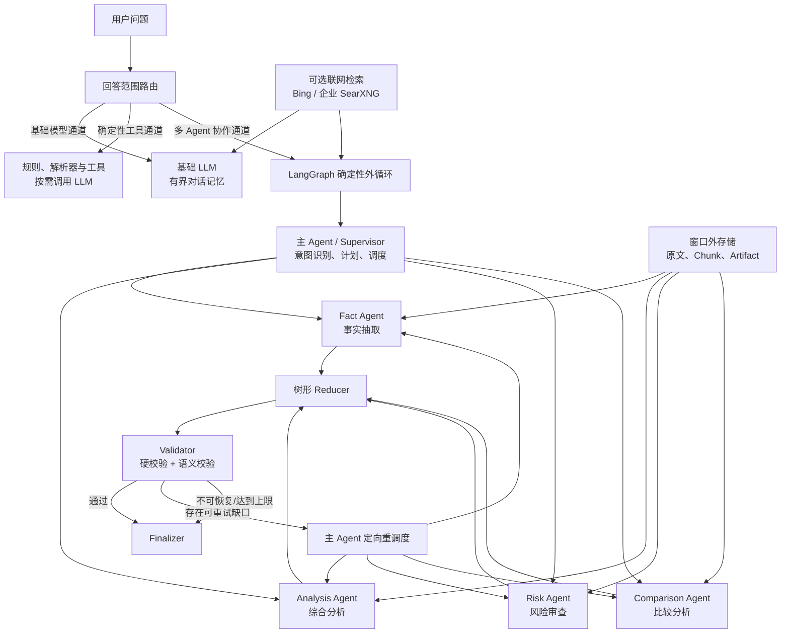
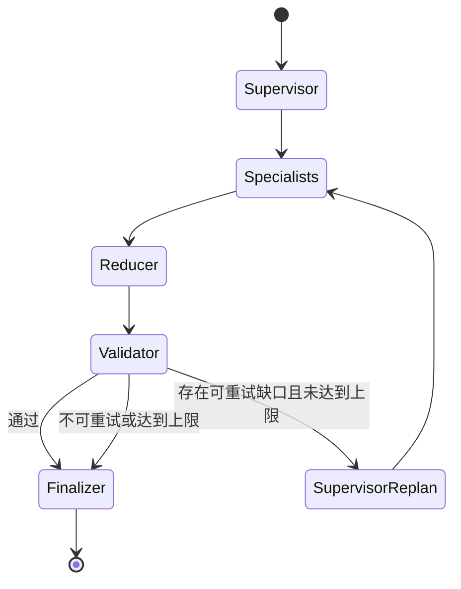

# Context Atlas：突破 64K 上下文瓶颈的 LangGraph 多 Agent 系统

> 项目类型：企业长文档研究智能体
> 底层模型：公司本地部署的 OpenAI Chat Completions 兼容模型
> 核心架构：LangGraph 确定性外循环 + 主 Agent 调度 + 专业 Agent 隔离执行 + 树形归并 + Validator
> 当前状态：30 项自动测试通过；177,420 Token 长文档离线基准 4/4 通过

首次使用请阅读：[《Context Atlas 使用说明书》](USER_GUIDE.md)

---

## 技术摘要

本项目解决的问题不是修改本地模型的原生 64K 上下文窗口，而是让系统在**底层模型不变、单次调用仍不超过 64K**的前提下，处理总量远大于 64K 的文档和研究任务。

系统采用分治思想：主 Agent 只管理问题、任务表和执行状态，不读取完整原文；事实抽取、综合分析、风险审查和比较分析由相互隔离的专业 Agent 独立完成；原文与中间产物保存在模型窗口外，Agent 之间只传递有界摘要和证据 ID；大量结果通过固定扇入的树形 Reducer 分层归并，最后由 Validator 执行程序硬校验和模型语义校验。

当前基准使用约 **177,420 Token** 的测试资料，超过 64K 模型窗口约 2.77 倍。测试中最大单次 Agent Prompt 约 **1,410 Token**，所有调用均保持在 64K 安全边界内，文档首部、中部、末部和跨位置联合问题共 **4/4** 通过。

必须准确理解本项目的结论：

> 系统突破的是“单个 64K 模型能够完成的整体任务规模”，不是把模型的一次物理上下文窗口从 64K 修改成更大的数值。

---

## 1. 我在这个项目中学习和实现了什么

通过本项目，完成了从普通 LLM API 调用到可控企业 Agent 系统的完整实践：

1. 理解了模型上下文上限、请求体大小、消息字段大小和总任务资料量之间的区别。
2. 学会使用 LangGraph 构建有节点、条件边、动态 Worker 和受控循环的 Agent 工作流。
3. 实现了 Supervisor/Worker、Map-Reduce、Validator 和外部记忆等多 Agent 核心模式。
4. 理解了多 Agent 分治不能降低底层模型上限，但可以降低最大单次上下文占用。
5. 实现了 RAG 检索、首中尾位置覆盖、证据打包、引用闭环和指定页码精确读取。
6. 实现了程序硬规则与模型语义判断分离，避免模型自行改变工作流或绕过约束。
7. 实现了结构化 JSON 契约、自动修复、重规划和失败关闭机制。
8. 保留了底层 LLM 的通用问答能力，使文档 Agent 成为增强层，而不是取代原始模型。
9. 增加了联网检索、网页来源引用和企业 SearXNG 接入能力。
10. 建立了登录保护、API 临时句柄、可视化验收中心和长上下文自动测试。

---

## 2. 问题定义：为什么单 Agent 容易达到 64K

传统 Agent 经常把所有内容持续追加到同一条消息历史：

```text
Context(t)
= System Prompt
+ User History
+ Retrieved Documents
+ Tool Results
+ Intermediate Reasoning
+ Previous Agent Outputs
```

随着执行轮数增加，上下文通常单调增长：

```text
|Context(t)| >= |Context(t-1)|
```

达到模型上限后，系统只能截断历史、压缩内容、丢弃证据或让请求失败。自由 Group Chat 也不能自然解决该问题，因为多个 Agent 如果共享同一聊天记录，消息反而会增长得更快。

### 2.1 三种容易混淆的限制

| 限制 | 常见单位 | 本项目的处理方式 |
|---|---:|---|
| 模型上下文窗口 | Token | 每个 Agent 独立预算，任何调用均不得越界 |
| 单消息字段限制 | UTF-8 Bytes | 分块、限制 Evidence Pack 和结构化输出长度 |
| HTTP 请求体限制 | Bytes | 不把完整文档放入一次 JSON 请求；拆成多次模型调用 |

本项目主要验证的是 64K Token 模型窗口。如果公司网关还存在严格的 64KB 请求体限制，生产版本还应在 Token 预算器之外增加序列化字节预算器。

---

## 3. 总体技术架构



### 3.1 三条产品执行通道

| 通道 | 适用范围 | 是否使用 Agent Loop | 结果约束 |
|---|---|---:|---|
| 基础模型通道 | 不依赖复杂编排、可由基础模型直接处理的请求 | 否 | 使用有界对话记忆控制输入规模 |
| 确定性工具通道 | 可通过规则、解析器或外部工具稳定完成的请求 | 否 | 优先返回可复现、可追溯的工具结果 |
| 多 Agent 协作通道 | 需要任务分解、信息检索、专业处理、结果归并和质量验证的复杂请求 | 是 | 通过结构化契约、证据链和 Validator 约束结果 |

路由层根据任务复杂度、数据依赖和结果约束选择执行通道。简单任务直接处理，确定性任务优先使用工具，只有需要协作推理的任务才进入多 Agent 外循环，从而兼顾效率、可靠性和上下文容量。

主界面只提供正式的“智能工作台”。流程演示、64K 验收和离线测试模型已经移动到需要测试员权限的验证中心，避免业务用户把测试模型误认为正式 LLM。

---

## 4. Agent 功能与对应实现原理

本章从用户功能出发，说明每项功能由哪些组件完成、为什么采用该原理，以及它如何控制上下文。后面的“Agent 使用了哪些技术”再从框架和代码组件角度展开。

### 4.1 功能与原理总表

| 功能 | 用户入口 | 主要执行组件 | 核心原理 | 上下文控制方式 |
|---|---|---|---|---|
| 自动回答范围 | 选择“自动” | `ResearchApplication` 路由器 | 根据文档状态和明显聊天意图选择通用或文档链路 | 不让简单聊天进入完整 Agent 图 |
| 通用 LLM 问答 | 选择“通用” | `OpenAICompatibleClient` | 直接使用底层模型原有问答、写作和推理能力 | 最近 20 条消息、约 24K 输入预算 |
| 文档上传与解析 | 左侧上传区 | `file_parser.py`、`DocumentIndex` | 将 PDF、Word、PPT 和文本转成统一文本与页/章节结构 | 文档保存在索引层，不直接放入模型消息 |
| 长文档事实问答 | 选择“文档”并提问 | Supervisor、Fact Agent | 任务拆分 + 小范围混合检索 + 证据抽取 | 每个事实任务独立上下文，Evidence Pack 约 8K |
| 全文总结 | 提问“总结全文” | 3 个 Analysis Agent、Reducer | 文档开头、核心、末尾多视角覆盖 | 多个小窗口代替一次读取全文 |
| 风险与矛盾审查 | 提问风险、冲突、缺口 | Risk Agent | 风险意图路由 + 保留冲突证据 | 只加载风险相关局部证据 |
| 对比分析 | 提问比较、差异、异同 | Comparison Agent | 按比较维度生成结构化结论 | 缺失维度标记未知，不补入无关上下文 |
| 全文原文读取 | 提问“输出全文” | 确定性文档读取器 | 直接读取已解析文本，不经过 LLM | 每次最多约 12,000 字符，支持翻页 |
| 指定页码读取 | 提问“输出第16–20页” | 页码范围解析器 | 根据 `## 第 N 页` 标记精确截取 | 0 次模型调用，不占 LLM 上下文 |
| 指定页码分析 | 提问“分析第16–20页” | 页码解析器 + 临时索引 + Agent 图 | 先确定性缩小资料范围，再进行语义分析 | 只有目标页进入临时检索层 |
| 联网检索 | 开启“联网检索” | Bing/SearXNG、LLM 或文档 Agent | Search-Augmented Generation | 最多 5 个标题、URL、摘要进入上下文 |
| 证据引用 | 查看“原文引用” | Artifact Store、Citation Builder | Evidence ID 闭环 | Agent 传 ID，不传全部原文历史 |
| Agent 自动修正 | Validator 发现可重试缺口 | Validator、Supervisor Replan | 有界 Agentic Loop | 只重跑失败任务，默认最多 1 次 |
| 上下文可视化 | 查看回答容量卡片 | Token Metrics | 记录每个角色调用和最大 Prompt | 直接显示是否低于 64K 安全边界 |
| API 配置切换 | 左侧“模型连接” | API Profile、LLM Settings | 多配置会话管理和连接测试 | 密钥不进入 URL、报告和日志 |
| 流程演示与验收 | 进入验证中心 | Benchmark、Auth、Test UI | 固定长文档和端到端门禁 | 与正式工作台隔离，避免测试模型被误用 |

### 4.2 自动回答范围

**用户功能：** 在不确定应该选择通用问答还是文档问答时，保留“自动”。

**执行路径：**

```text
用户问题
→ 是否已经上传文档
→ 是否属于明显的普通聊天、写作或解释请求
→ 通用 LLM 或文档 Agent
```

**对应原理：** 这是应用层意图路由。没有文档时自动使用通用 LLM；已经有文档时，文档相关问题优先进入多 Agent，明显的普通聊天仍直接使用 LLM。

**为什么这样设计：** 多 Agent 不是所有问题的默认最优解。简单问题如果也进入 Supervisor、检索、Reducer 和 Validator，会增加延迟、调用次数和错误点。

### 4.3 通用 LLM 问答

**用户功能：** 像普通智能体一样进行聊天、写作、解释、翻译或代码问答，无需上传文档。

**执行路径：**

```text
问题 + 最近对话
→ 24K 对话预算检查
→ 企业 OpenAI 兼容 API
→ 直接回答
```

**对应原理：** Bounded Conversation Memory。系统保留最近最多 20 条用户与助手消息；如果估算输入超过约 24K Token，就从最早的历史开始裁剪。

**技术意义：** 文档 Agent 是底层 LLM 的增强层，而不是替代品。通用回答不要求文档引用，也不经过文档 Validator。

### 4.4 文档上传、解析和索引

**用户功能：** 上传 PDF、Word、PowerPoint、Markdown、TXT 等资料，查看文件大小、估算 Token、Chunk 和 Section 数量。

**执行路径：**

```text
二进制文件
→ 格式与安全检查
→ 提取正文、标题、表格、页码或备注
→ Parent Section
→ Child Chunk
→ 本地混合检索索引
```

**对应原理：** 文档摄取层与模型推理层分离。解析后的全文保存在服务端索引中，模型只在具体子任务执行时获得少量检索片段。

**上下文意义：** 上传 177K Token 文档不会产生一个 177K Prompt。上传阶段主要是本地解析和建索引，不调用 LLM。

### 4.5 长文档事实问答

**用户功能：** 从大型资料中查找项目编号、名称、日期、数值、条件和原文事实。

**执行路径：**

```text
问题
→ 主 Agent 识别 fact_lookup
→ 创建最小 Fact Task
→ BM25 + TF-IDF + RRF 检索
→ Fact Agent 抽取事实和 Evidence ID
→ Validator 检查证据
→ Finalizer 回答
```

**对应原理：** Retrieval-Augmented Generation 与任务最小化。明确的单事实问题不调用模型 Supervisor 自由拆解，而是直接生成一个事实任务。

**技术优势：** 减少规划错误和一次模型调用；专业 Agent 只看到与事实相关的小证据包，不接收全文。

### 4.6 全文总结

**用户功能：** 概括整份资料的背景、核心内容、结论、行动项和限制。

**执行路径：**

```text
总结请求
→ 开头背景 Analysis Task
→ 中部核心 Analysis Task
→ 末尾结论 Analysis Task
→ 三个独立 Analysis Agent
→ 树形 Reducer
→ Validator
→ Finalizer
```

**对应原理：** Positional Coverage + Map-Reduce。关键词 Top-K 无法保证看到文档尾部，因此系统强制对首、1/4、中、3/4、尾位置采样，并按任务目标调整顺序。

**上下文意义：** “总结全文”不是把全文交给一个模型，而是让多个 Agent 分别形成有边界的局部视角，再逐层归并。

### 4.7 风险、矛盾和缺口审查

**用户功能：** 查找相互冲突的信息、风险点、缺失条件和需要复核的内容。

**执行路径：**

```text
风险意图
→ Risk Task
→ 风险相关检索
→ Risk Agent 保留冲突证据
→ Validator 检查 contradictions
→ 输出风险和复核建议
```

**对应原理：** 专业角色提示词与矛盾保留策略。Risk Agent 不负责把冲突强行合并成单一事实，而是明确记录不同证据及其来源。

**技术优势：** 避免普通总结 Agent 为了生成流畅答案而掩盖矛盾。

### 4.8 对比分析

**用户功能：** 比较不同方案、章节、时间点或对象的共同点和差异。

**对应原理：** 结构化维度比较。Comparison Agent 只按任务指定的维度输出；证据没有覆盖的维度标记为未知，不能依靠语言模型补全企业文档事实。

**上下文意义：** 比较对象按任务检索，不需要把所有章节和所有历史同时放进一个 Prompt。

### 4.9 全文读取与分页

**用户功能：** 直接查看 PDF、Word、PPT 或文本的解析内容。

**执行路径：**

```text
“输出全文/查看原文”
→ 确定性意图识别
→ 从 document_text 读取
→ 每次返回约 12,000 字符
→ 上一段/下一段
```

**对应原理：** 原文读取是数据访问问题，不是语义生成问题，因此绕过 LLM、Supervisor、检索和 Validator。

**技术优势：** 不消耗模型 Token；不会因为检索只返回 Top-K 而把局部内容误称为全文。

### 4.10 指定页码读取与分析

**用户功能：** 输出或分析一个明确页码范围，例如第 16–20 页。

**原文读取路径：**

```text
解析页码范围
→ 验证每一页的 `## 第 N 页` 标记
→ 精确拼接目标页
→ 直接返回
```

**分析路径：**

```text
精确提取目标页
→ 为目标页建立临时 DocumentIndex
→ 多 Agent 仅在该索引内检索和分析
```

**对应原理：** Deterministic Filter Before Semantic Search。确定性条件必须在语义检索之前执行。

**技术优势：** 解决“请求第 16–20 页，却检索到第 1、3、30 页”的错误。

### 4.11 联网检索

**用户功能：** 获取当前文档之外的公开信息和具有时效性的资料。

**执行路径：**

```text
联网开关开启
→ Bing 或企业 SearXNG
→ 最多 5 个标题、URL、摘要
→ 通用 LLM 或文档临时索引
→ 带网页来源回答
```

**对应原理：** Search-Augmented Generation。系统先取得可审计的搜索结果，再把有编号的网页摘要作为外部证据交给模型。

**边界：** 当前默认使用搜索摘要而不是完整网页；摘要没有覆盖的信息不能被当成确定事实。搜索失败会显式报错，不允许模型假装联网成功。

### 4.12 证据引用与可追溯回答

**用户功能：** 在回答下方查看原文摘录、文档名、章节、页码或网页链接。

**对应原理：** Artifact ID 闭包。Worker 只能引用本轮检索生成的 Evidence ID；Reducer 只能保留 Worker 已经提供的 ID；Validator 检查 Reducer 是否引入未知证据。

```text
原文 Chunk
→ Evidence Artifact
→ Finding.evidence_ids
→ Reducer.evidence_ids
→ Final Citation Card
```

**技术优势：** 最终答案可以追溯；Agent 之间只传短 ID 和有界摘要，减少上下文重复。

### 4.13 Validator、自动修复和定向重规划

**用户功能：** 系统自动发现缺失任务、无效引用、矛盾、格式错误和上下文越界，并给出失败原因。

**对应原理：** Guardrails + Bounded Agentic Loop。

- JSON 无法解析或缺少字段时，原角色最多修复一次。
- Finding 缺失时，Validator 返回 `retryable_task_ids`。
- 主 Agent 只重调度失败任务，不重新执行成功任务。
- 达到最大重规划次数后失败关闭。

**技术优势：** 提高本地模型格式不稳定时的成功率，同时防止无限重试。

### 4.14 上下文与执行过程可视化

**用户功能：** 查看文档估算 Token、最大单次 Prompt、窗口占用、任务数、模型调用次数、专业 Agent 隔离状态和完整图执行轨迹。

**对应原理：** Observability。每次 `_call` 都记录角色、估算或实际 Prompt Token、角色预算和计量来源；最终聚合为 `context_metrics` 与 `capacity_report`。

**技术优势：** “突破64K”不再只是架构宣称，而可以检查是否确实存在超长文档、是否每次调用都低于窗口、Supervisor 是否接收原文。

### 4.15 API 配置、连接测试与安全复用

**用户功能：** 保存和切换不同 Base URL、模型名与超时设置，并测试连接。

**对应原理：** 主界面保存当前浏览器会话配置；连接成功后，服务端内存生成随机临时 Profile Token。验证中心只提交临时句柄，不重新输入或返回 API Key。

**安全边界：** API Key 不进入 URL、测试报告和服务器日志；服务重启或句柄过期后需要重新验证。

### 4.16 验证中心和失败诊断

**用户功能：** 流程演示、真实 API 长上下文测试、六项验收门禁、逐用例审计、失败原因和 JSON 报告导出。

**对应原理：** 测试面与生产面分离。离线 `DeterministicTestModel` 只验证图拓扑、固定测试事实、上下文隔离和引用闭环，不承担普通业务问答。

失败结果会说明：

- 缺少哪些预期事实；
- 是否没有引用；
- 哪一项程序硬校验失败；
- Validator 是否返回非法 JSON；
- 是否存在缺失任务或矛盾；
- 当前失败是否可重试。

**技术优势：** 防止把离线流程模型误认为真实 LLM，也让真实 API 的失败可以定位到规划、检索、执行、归并或验证阶段。

---

## 5. Agent 使用了哪些技术

### 5.1 LangGraph `StateGraph`

系统使用 LangGraph 显式定义节点、状态、边、条件路由和循环：

```text
START
→ supervisor
→ specialist workers
→ reducer
→ validator
→ supervisor_replan 或 finalizer
→ END
```

技术优势：

- 控制流由代码拥有，模型不能自由跳转节点。
- 节点输入输出可以审计，便于复现失败。
- `Send` 可以根据任务数量动态创建独立 Worker State。
- `MemorySaver` Checkpointer 保存每个图执行阶段的状态。
- 条件边可以形成有最大次数限制的 Agent Loop。

### 5.2 确定性外循环

模型负责语义任务，程序负责循环、预算、路由白名单和停止条件。Validator 不能直接决定无限重试，主 Agent 也不能自行增加循环次数。

当前最大重规划次数默认为 1：

```text
Validator 拒绝
→ 程序检查 retryable_task_ids
→ 只重新执行失败任务
→ 再次 Reduce 和 Validate
→ 通过或失败关闭
```

技术优势：可控、防失控、容易测试，不会出现自由 Agent 无限思考或重复调用。

### 5.3 主 Agent：确定性路由与模型规划组合

主 Agent 不再对所有问题都调用模型自由拆解，而是先判断明确意图：

| 意图 | 调度策略 |
|---|---|
| 单事实查询 | 直接创建一个 `fact_extractor` 任务 |
| 风险或矛盾 | 直接路由到 `risk_reviewer` |
| 比较或差异 | 直接路由到 `comparator` |
| 全文总结 | 创建开头、核心、末尾三个互补任务 |
| 多目标或开放研究 | 调用模型 Supervisor 生成任务，再由程序校验 |

技术优势：简单问题减少一次规划调用，复杂问题保留 LLM 语义规划能力，同时降低过度拆解和重复任务概率。

### 5.4 专业 Agent 隔离执行

系统定义四类专业角色：

| Agent | 职责 | 输入特点 |
|---|---|---|
| `fact_extractor` | 抽取数值、名称、条件和事实 | 精确相关证据 |
| `analyst` | 总结主题、原因、影响和结论 | 相关证据 + 位置覆盖 |
| `risk_reviewer` | 识别风险、矛盾、缺口 | 冲突与风险相关证据 |
| `comparator` | 按维度比较不同对象 | 比较对象相关证据 |

每个 Worker 都使用新的消息列表，只知道自己的 `TaskSpec` 和 Evidence Pack，不读取其他 Worker 的聊天历史。

技术优势：上下文不相互污染；一个 Worker 失败不会破坏其他任务；不同角色可以使用不同预算和提示词。

### 5.5 分层 RAG 检索

文档先按标题形成 Parent Section，再拆成约 1,200 Token 的 Child Chunk。检索组合使用：

- BM25；
- TF-IDF Cosine；
- Reciprocal Rank Fusion；
- 文档首部、中部、末部的位置覆盖；
- 按 `chunk_id` 去重；
- 每个 Worker 最多打包约 8,000 Token 证据。

全文总结不能只依赖关键词 Top-K，因此系统对分析任务强制抽取首、1/4、中、3/4、尾位置。开头任务从前向后排列，末尾任务从后向前排列，核心任务从中间向两侧排列。

技术优势：精确问题保持高相关性；宽泛总结不会因为查询词不在正文中而遗漏文档尾部。

### 5.6 Artifact Store 外部记忆

原文和中间产物不持续放在模型上下文，而是写入 Artifact Store：

```text
Evidence Artifact  → evidence_xxx
Worker Finding     → finding_xxx
Reducer Result     → reduction_xxx
```

图状态主要传递 ID、有界摘要和状态字段。最终引用再根据 Evidence ID 还原文档、章节和摘录。

技术优势：把“存储内容”与“模型思考窗口”分离；支持证据闭环；避免主 Agent 接收所有原文。

### 5.7 树形 Reducer

如果有大量 Worker 结果，不能一次性全部交给主 Agent：

```text
错误：Worker 1...100 → 一个超大 Supervisor Prompt

正确：
100 Findings
→ 每 4 个合并一次
→ 25 个 Reduce Results
→ 7 个 Reduce Results
→ 2 个 Reduce Results
→ 1 个最终结果
```

Reducer 默认扇入为 4，可配置范围为 2–8。每一层只读取一小组结构化 Finding，不读取原文。

技术优势：归并阶段的最大单次输入近似受 `fan_in × 单结果大小` 控制，不随 Worker 总数线性增长。

### 5.8 Validator 双层验证

Validator 包含两个不可互相替代的层次。

程序硬校验检查：

- Task ID 是否唯一；
- 每个任务是否产生 Finding；
- Evidence 和 Finding Artifact 是否真实存在；
- Reducer 是否引入未知证据；
- 每次模型调用是否仍在上下文安全预算内。

模型语义校验检查：

- 是否存在缺失任务；
- 是否存在结论矛盾；
- 当前答案是否满足语义质量要求。

只有硬校验与语义校验同时通过，结果才会标记为批准。模型不能绕过程序硬规则。

### 5.9 结构化输出与自动修复

Supervisor、Specialist、Reducer 和 Validator 都要求 JSON 输出。系统会解析代码块和 JSON 对象，并检查必需字段。

```text
首次响应
→ JSON 解析与字段检查
→ 失败时携带原任务和错误片段修复一次
→ 再失败则安全降级或拒绝
```

技术优势：降低本地模型偶发格式错误对整个 Agent 图的影响，同时通过一次重试上限避免无限修复。

### 5.10 OpenAI 兼容 API 客户端

所有正式模型调用通过现有 OpenAI Chat Completions 兼容接口：

```text
POST {OPENAI_BASE_URL}/chat/completions
Authorization: Bearer <API_KEY>
```

客户端使用系统 `curl` 兼容企业 TLS 环境；API Key 通过标准输入传给 `curl`，不会出现在进程参数中；错误信息会对 `sk-...` 形式密钥做脱敏。

### 5.11 通用 LLM 有界对话记忆

文档 Agent 是增强层，不会取消底层模型的普通能力。选择“通用”后，问题直接发送给企业 LLM，并携带最近最多 20 条对话。

通用聊天输入预算约为 24,000 Token。超出预算时从最早历史开始裁剪，因此不会让聊天历史无限接近 64K。

### 5.12 联网检索

联网开关开启后，系统先搜索最多 5 个公开网页来源，再把标题、URL 和摘要放入有界上下文。默认搜索后端为 Bing，也可以通过服务端环境变量接入企业 SearXNG：

```bash
export CONTEXT_ATLAS_SEARXNG_URL="https://search.company.internal"
```

技术优势：为时效性问题提供外部信息；来源以可点击卡片显示；搜索失败会显式报错，不允许模型伪装成已经联网。

---

## 6. 系统如何突破上下文瓶颈

### 6.1 核心数学关系

单 Agent 要求：

```text
全部原文 + 全部历史 + 全部工具结果 + 全部推理 < 64K
```

多 Agent 分治要求：

```text
max(
  Supervisor Context,
  Worker Contexts,
  Reducer Contexts,
  Validator Context,
  Finalizer Context
) < 64K
```

系统处理能力取决于多个独立调用和窗口外存储的组合，而不再要求所有资料同时进入一个模型窗口。

### 6.2 六个关键机制

1. **原文分块**：完整文档保留在检索层，不直接进入主 Agent。
2. **任务分治**：复杂目标拆成多个可独立验证的子任务。
3. **上下文隔离**：每个专业 Agent 使用新的消息上下文。
4. **外部记忆**：证据和中间结果保存在 Artifact Store，图中传 ID。
5. **树形归并**：大量结果逐层压缩，不形成超大汇总 Prompt。
6. **硬预算与验证**：每次调用计量 Token，Validator 检查是否越界。

### 6.3 当前上下文预算

模型物理窗口按 64,000 Token 计算：

```text
64,000
- 2,000 输出预留
- 1,000 安全余量
= 61,000 最大安全输入边界
```

每个角色还有更小的独立软预算：

| 角色 | 输入预算上限 |
|---|---:|
| Supervisor | 8,000 Token |
| Fact Extractor | 12,000 Token |
| Analyst | 16,000 Token |
| Risk Reviewer | 14,000 Token |
| Comparator | 16,000 Token |
| Reducer | 16,000 Token |
| Validator | 10,000 Token |
| Finalizer | 20,000 Token |
| 通用对话记忆 | 24,000 Token |

专业 Agent 的 Evidence Pack 进一步限制在约 8,000 Token。软预算远低于 64K，可以给输出、模板误差和企业网关差异保留空间。

### 6.4 一个超过 64K 的任务如何执行

假设文档约 177K Token，用户要求同时找出首部项目代号、中部验收口令和末部归档值：

```text
177K 文档进入本地索引
→ 主 Agent 只读取问题，生成 3 个事实任务
→ Worker A 检索首部小证据包
→ Worker B 检索中部小证据包
→ Worker C 检索末部小证据包
→ 三个 Worker 独立调用模型
→ Reducer 合并三个结构化 Finding
→ Validator 检查任务、证据和上下文预算
→ Finalizer 生成带引用答案
```

整个过程中，没有任何一次模型调用接收 177K 原文。

### 6.5 指定页码为什么单独处理

“输出第 16–20 页”是确定性定位任务，不应该使用语义检索。PDF/PPT 解析时会保留 `## 第 N 页` 标记，系统验证目标页全部存在后直接返回对应原文，模型调用次数为 0。

“分析第 16–20 页的风险”则先精确截取这些页面，建立局部索引，再让多 Agent 只分析目标页。

技术优势：不会因为语义检索召回了第 1、3、30 页而错误声称目标页面不存在。

---

## 7. Agentic Loop 是如何实现的

系统确实使用 Agent Loop，但它是受控循环，不是自由对话循环。



循环由以下条件限制：

- 只重新调度 `retryable_task_ids`；
- 不重新执行已经成功的任务；
- 默认最多重规划 1 次，可配置 0–3 次；
- 没有可重试任务时直接失败关闭；
- 每次循环仍必须满足角色 Token 预算。

这种设计保留了 Agent 的“观察—执行—验证—修正”能力，同时避免无限 Agentic Loop 造成上下文、成本和延迟失控。

---

## 8. 技术优势与代价

### 8.1 主要优势

| 优势 | 具体体现 |
|---|---|
| 处理更大总资料 | 文档总量可以超过单模型窗口 |
| 单次调用可控 | 每个角色有独立预算和硬校验 |
| 主 Agent 不成为瓶颈 | 不读取完整原文和 Worker 对话历史 |
| 上下文隔离 | Worker 之间不共享消息历史 |
| 证据可追溯 | Finding 只能引用真实 Evidence Artifact |
| 工作流稳定 | LangGraph 条件边和循环次数由代码控制 |
| 错误可定位 | 可查看任务、检索策略、调用预算、Validator 原因和执行轨迹 |
| 简单问题效率更高 | 确定性路由减少不必要的 Supervisor 调用 |
| 保留原始 LLM 能力 | 通用问答不经过文档证据门禁 |
| 支持时效性信息 | 可选联网检索并显示来源 |

### 8.2 必须接受的代价

- 多 Agent 通常增加总模型调用次数和总 Token。
- 并行 Worker 会增加本地推理服务的瞬时并发压力。
- 任务拆分错误可能导致全局结论缺失。
- Worker 摘要和 Reducer 压缩可能丢失细节。
- 搜索摘要不等于完整网页，联网答案仍需审慎核实。
- 当前 Artifact Store、API Profile 和 Checkpointer 主要为内存实现，服务重启后会失效。
- 多 Agent 不能让底层模型获得原本不具备的知识和推理能力。

---

## 9. 测试如何证明突破成立

### 9.1 当前验证结果

| 指标 | 结果 |
|---|---:|
| 自动测试 | 30 项通过 |
| 长文档估算 Token | 177,420 |
| 模型窗口参考值 | 64,000 |
| 最大单次 Agent Prompt | 约 1,410 Token |
| 位置用例 | 4/4 通过 |
| Supervisor 接收完整原文 | 否 |
| 专业 Agent 上下文隔离 | 是 |
| 所有调用低于窗口 | 是 |

> 离线基准的 Token 为本地估算值；真实 API 模式如果网关返回 usage，则系统优先记录实际 `prompt_tokens`。

### 9.2 四个端到端用例

1. 文档开头 Needle：唯一有效项目代号。
2. 文档中部 Needle：中期验收口令。
3. 文档末尾 Needle：最终归档校验值。
4. Multi-hop：一次回答首、中、尾三个事实并保留引用。

### 9.3 六项验收门禁

| 门禁 | 通过条件 |
|---|---|
| 测试文档超过窗口 | 估算 Token 大于 65,536 |
| 每次 Agent 调用不越界 | Prompt + 输出预留 + 安全余量不超过 64K |
| Specialist 隔离 | 每个 Worker 使用独立 State 和消息列表 |
| Supervisor 不读原文 | 主 Agent 只读取目标和任务状态 |
| Validator 批准 | 程序硬校验与语义校验同时通过 |
| 用例和引用完整 | 4 个用例正确且存在 Evidence 引用 |

### 9.4 运行测试

```bash
python3 -m unittest discover -s tests -v
```

运行 64K+ 离线基准：

```bash
python3 -m long_context_agent.benchmark \
  --document test_data/enterprise_research_128k.md \
  --cases test_data/test_cases.json \
  --mode offline
```

验证中心还支持使用主界面最近一次连接成功的真实 API 运行同一套基准。失败用例会显示标准化失败原因、阶段、缺失事实、Validator 说明和是否可重试。

---

## 10. 文件解析和文档能力

| 格式 | 扩展名 | 解析内容 |
|---|---|---|
| PDF | `.pdf` | 文本层、页码标记 |
| Word | `.docx` | 标题、段落、表格 |
| PowerPoint | `.pptx` | 幻灯片文本、页码、演讲者备注 |
| 旧版 Office | `.doc`、`.ppt` | 依赖本地转换工具后解析 |
| 文本 | `.txt`、`.md`、`.csv`、`.json`、`.html`、`.xml`、`.rtf` | 文本内容 |

单文件最大 20 MB。PDF 如果是纯扫描图片且没有文本层，系统会明确提示需要 OCR，不会让 Agent 在没有原文的情况下编造答案。

---

## 11. 主界面与验证中心

### 11.1 主界面：正式智能工作台

主界面提供：

- 企业 LLM API 配置和连接测试；
- 文档上传与 Token、Chunk、Section 统计；
- 自动、通用、文档三种回答范围；
- 可选联网检索；
- 回答、引用、执行轨迹和上下文占用可视化；
- 原文分页读取；
- API 配置会话保存。

主界面不再显示“流程演示”运行按钮，避免业务问答误用离线确定性测试模型。

### 11.2 验证中心：受权限保护的诊断工作台

验证中心包含：

- 离线流程演示；
- 真实 API 长上下文验收；
- 六项验收门禁；
- 角色调用次数和最大 Prompt；
- 用例任务、Validator、轨迹和引用审计；
- 失败原因显示；
- JSON 测试报告导出。

本地默认测试账号：

```text
用户名：tester
密码：123456
```

该账号只适合本地演示。生产部署必须通过环境变量修改，或接入企业 OIDC/LDAP。

---

## 12. 安装与运行

### 12.1 环境要求

- Python 3.9+
- 系统 `curl`
- 可选：LibreOffice，用于旧版 Office 转换

安装：

```bash
python3 -m pip install -e .
```

### 12.2 启动服务

```bash
python3 -m long_context_agent.web_server --port 8080
```

### 12.3 API 配置

可以直接在主界面填写：

```text
Base URL: https://your-company.example/v1
API Key:  由公司分配的密钥
Model:    公司部署的模型名
```

也可以为命令行真实基准设置环境变量：

```bash
export OPENAI_BASE_URL="https://your-company.example/v1"
export OPENAI_API_KEY="your-api-key"
export OPENAI_MODEL="your-model"
```

不要把真实 API Key 写入 README、源码或提交记录。曾经在聊天、日志或截图中暴露的密钥应立即轮换。

---

## 13. 使用说明

### 普通智能体问答

1. 配置并测试企业 API。
2. 回答范围选择“通用”或“自动”。
3. 直接提问，无需上传文档。

### 长文档问答

1. 上传 PDF、Word、PPT 或文本。
2. 选择“文档”或保留“自动”。
3. 提问总结、事实、比较或风险问题。
4. 查看回答下方的引用和执行轨迹。

### 指定页面读取

```text
请输出第 16–20 页内容。
```

系统会按页码直接返回解析原文，不调用 LLM。

### 联网问答

1. 勾选“联网检索”。
2. 系统自动使用正式智能回答模式。
3. 搜索结果以可点击来源卡片显示。

---

## 14. 项目目录

```text
long-context-research-agent/
├── long_context_agent/
│   ├── orchestrator.py      # LangGraph、多 Agent、Reducer、Validator
│   ├── document.py          # 分块、层级索引和混合检索
│   ├── artifacts.py         # 窗口外 Evidence/Finding 存储
│   ├── schemas.py           # TaskSpec 和结果数据契约
│   ├── file_parser.py       # PDF、Word、PPT、文本解析
│   ├── llm.py               # OpenAI 兼容企业 LLM 客户端
│   ├── web_search.py        # Bing / SearXNG 联网检索
│   ├── benchmark.py         # 64K+ 测试和失败原因
│   └── web_server.py        # API、登录、文档和 Web 服务
├── web/
│   ├── index.html           # 正式智能工作台
│   ├── app.js
│   ├── styles.css
│   ├── test.html            # 受保护验证中心
│   └── test.js
├── test_data/
│   ├── enterprise_research_128k.md
│   └── test_cases.json
├── design-system/
│   └── context-atlas/MASTER.md # UI设计规范
├── tests/
└── README.md
```

---

## 15. 关键可观察指标

每次多 Agent 回答会记录：

| 指标 | 含义 |
|---|---|
| `planning_source` | 确定性路由或模型 Supervisor |
| `intent` | 识别出的任务类型 |
| `max_single_agent_prompt_tokens` | 本次最大单 Agent 输入 |
| `max_window_utilization_percent` | 最大窗口占用比例 |
| `all_agent_calls_within_limit` | 所有调用是否在安全边界内 |
| `retrieval_strategies` | 精确检索或位置覆盖策略 |
| `structured_output_retries` | JSON 自动修复次数 |
| `specialist_counts` | 各专业 Agent 任务数量 |
| `model_calls` | 模型调用总次数 |

这些指标可以区分规划错误、检索漏召回、模型格式错误、Validator 拒绝和上下文越界风险。

---

## 16. 安全设计

- API Key 不进入 URL、测试报告或服务器日志。
- 连接成功后，服务端在内存保存 API 设置，并返回不含密钥的随机临时句柄。
- 验证中心只复用已验证句柄，不允许另填一套 API。
- 服务重启或句柄过期后必须重新测试连接。
- 浏览器会话保存适合本地原型，不等于生产级密钥管理。
- 搜索目标由服务端固定或通过服务端环境变量配置，浏览器不能提交任意搜索主机，降低 SSRF 风险。
- ZIP 类 Office 文件解析包含体积、成员数量和压缩比检查。

---

## 17. 当前局限和生产化路线

### 当前局限

- Checkpointer、Artifact Store 和已验证 API Profile 主要保存在内存中。
- 当前检索为本地稀疏混合检索，没有企业向量数据库。
- 联网证据主要使用搜索结果摘要，没有抓取和清洗完整网页。
- 扫描 PDF 尚未集成 OCR。
- 离线基准验证架构与固定事实，不代表真实模型在所有业务文档上的准确率。
- 当前测试证明“最大单次调用不越界”，不证明多 Agent 总成本低于单 Agent。

### 建议生产化顺序

1. 将 Checkpointer 替换为 SQLite 或 PostgreSQL。
2. 将 Artifact Store 替换为带租户、权限和生命周期管理的对象存储。
3. 接入企业向量数据库和 Embedding，保留位置覆盖作为总结类补充。
4. 接入企业 OIDC/LDAP 和密钥管理系统。
5. 增加 Worker 超时、重试退避、幂等键和断点恢复。
6. 根据本地推理服务吞吐设置并发信号量。
7. 增加 OCR、表格结构识别和图片理解。
8. 建立单 Agent 与多 Agent 的准确率、延迟、总 Token 和最大单次上下文对照实验。

---

## 18. 最终结论

本项目采用的最终方案是：

```text
LangGraph 确定性外循环
+ 主 Agent 统一调度
+ 专业 Agent 独立上下文
+ 分层 RAG 与位置覆盖
+ 窗口外 Artifact Store
+ 树形 Reducer
+ Validator 硬校验与语义校验
+ 有界 Agentic Loop
+ 每角色 Token 预算
+ 通用 LLM 双通道
+ 可选联网检索
```

它的核心价值不是让一个模型请求硬塞进更多文本，而是把一个超大任务组织成多个有边界、可验证、可恢复的小调用。

因此，在底层模型仍然只有 64K 上下文的情况下，系统可以处理超过 64K 的整体资料，同时保证：

- 主 Agent 不读取完整原文；
- 专业 Agent 不共享聊天历史；
- 每次模型调用低于安全边界；
- 中间结果不会无限堆积；
- 最终结论可以追溯到证据；
- 失败任务可以被定向修正；
- 普通 LLM 能力不会因为文档 Agent 而丢失。

这才是“在不更换、不修改底层模型的前提下突破上下文瓶颈”的正确工程实现。
