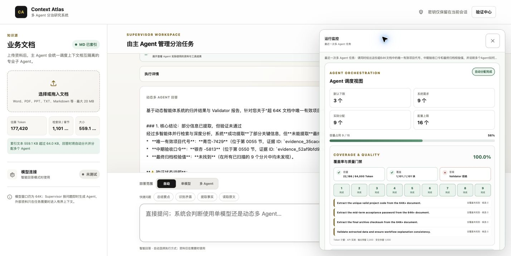
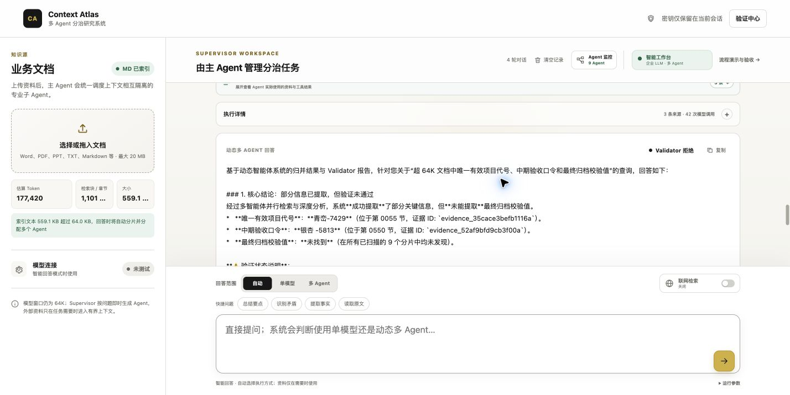
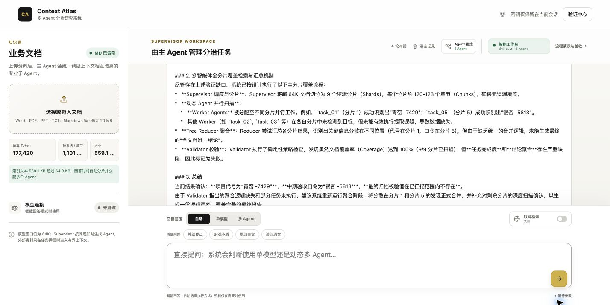
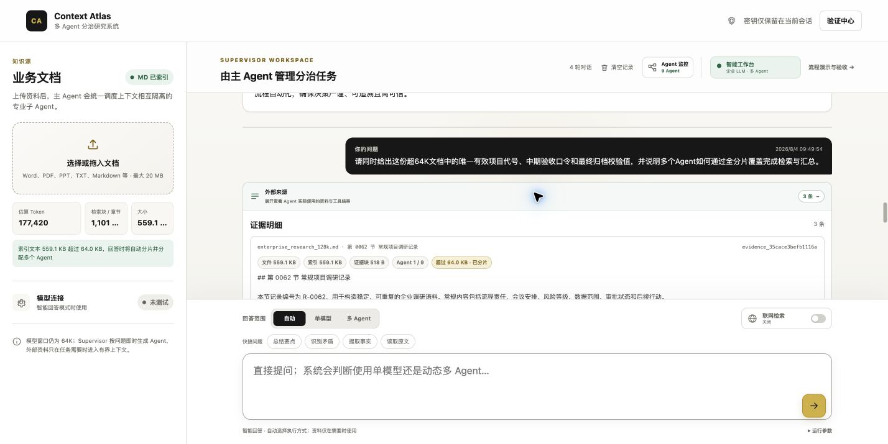
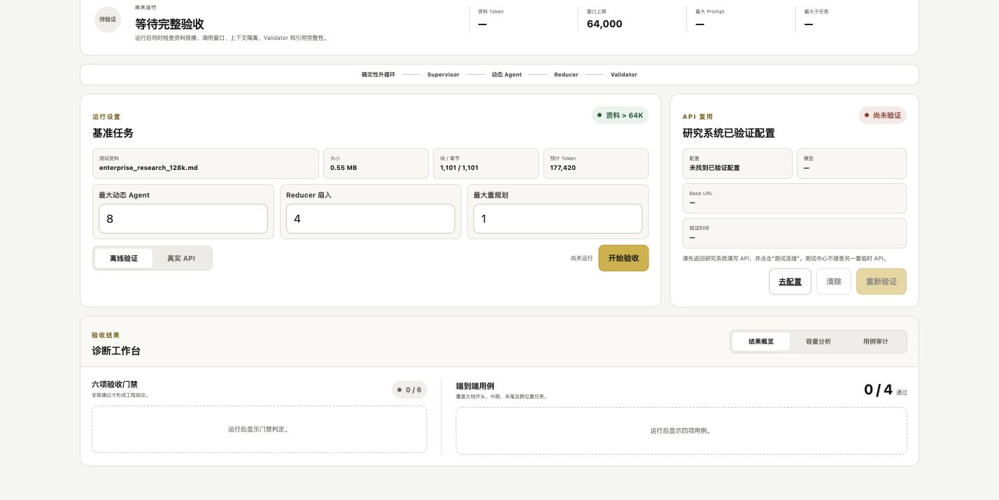
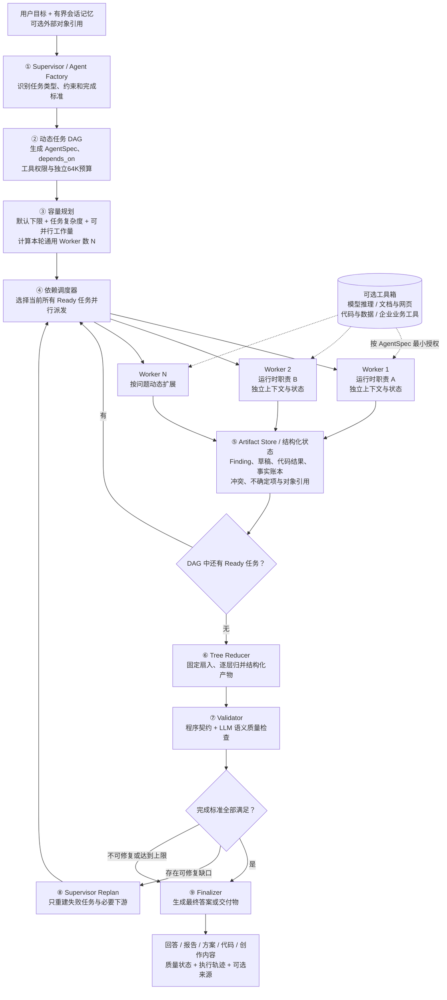
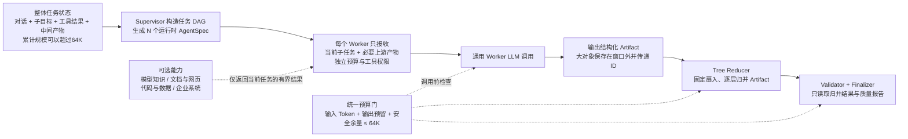

# Context Atlas

> 基于 LangGraph 的确定性多 Agent 系统，让固定上下文窗口的模型能够处理总体规模更大的复杂任务。

Context Atlas 建立在 OpenAI Chat Completions 兼容模型之上，采用主 Agent 动态生成执行 Agent、通用 Worker 隔离运行、窗口外状态、树形归并和 Validator 验证，在不修改底层模型的前提下扩展应用层任务容量。

系统突破的是**整体任务规模**，不是模型单次调用的物理上下文窗口。每次模型调用仍严格保持在原始限制以内。

## 为什么需要 Context Atlas

普通 Agent 往往把系统提示、对话历史、检索内容、工具结果和中间输出持续追加到同一个上下文：

```text
Context(t)
= System Prompt
+ Conversation History
+ Retrieved Content
+ Tool Results
+ Intermediate Outputs
```

随着任务持续执行，上下文会不断增长。达到模型上限后，系统只能截断信息、压缩历史或者终止请求。多个 Agent 如果继续共享同一条对话历史，也只会让上下文增长得更快。

Context Atlas 使用另一种协作方式：

```text
任意复杂问题
→ 识别问题类型
→ 动态生成 Agent 规格
→ 分配能力、工具和独立预算
→ 隔离执行
→ 分层归并
→ 结果验证
```

Agent 可以只使用模型原生推理，也可以按任务需要使用上传资料、网络来源或其他工具。外部资料不是运行 Agent Loop 的前提；所有 Agent 通过结构化结果、Artifact ID 和任务状态协作。

## 核心能力

| 能力 | 说明 |
|---|---|
| 基础模型能力 | 保留底层模型原有的理解、生成和推理能力 |
| 连续对话 | 追加保留每轮问题、回答、来源和执行指标，并向后续任务提供有界对话记忆 |
| 动态 Agent 生成 | 根据当前问题即时生成 Agent 名称、任务指令、能力、工具和来源策略 |
| 通用问题处理 | 无需上传资料即可使用多个隔离 Agent 完成分析、创作、规划、编程思路等任务 |
| 可选外部能力 | 按任务需要使用上传资料、网络来源或后续扩展的业务工具 |
| 长上下文任务 | 通过依赖分解、Token 均衡分片、全分片覆盖和分层归并处理大规模信息 |
| 证据追踪 | 使用证据标识连接原始资料、中间产物和最终结果 |
| 质量验证 | 将容量、资料覆盖和答案正确性分成三道独立门禁，防止“调用未越界”被误当成“答案正确” |
| 容量治理 | 根据任务和资料规模自动分配 Agent，并为调用、分片和中间产物设置独立预算 |
| 来源可观察性 | 展示来源文件、索引文本、证据块的字节大小及其分片归属 |

## 产品使用与实测截图

以下图片均来自本地产品实际运行，不是静态设计稿。测试资料为仓库内置的 `enterprise_research_128k.md`：索引文本559.1 KB、估算177,420 Token、共1,101个资料块，整体规模明显超过单模型64K窗口。运行参数为默认至少3个 Agent、最多16个 Agent。

### 1. 主界面总览


左侧负责资料与模型配置，中部保留连续对话，Agent 监控和验证中心位于顶部工具区。载入超64K资料后，页面直接显示 Token、资料块、文件字节数和自动分片提示。资料可以保持已索引，但只有获得工具权限的任务才会读取它。

### 2. 动态 Agent、全分片覆盖与三道门禁



这张图展示本轮实际分配9个运行时 Agent：

- **3 → 9 / 16**：默认下限为3个，系统根据工作量计算需要9个，未超过16个配置上限；
- **容量门禁通过**：最重调用的输入、输出预留和安全余量没有超过64K；
- **覆盖门禁通过**：9个分片全部完成，1,101 / 1,101个资料块已扫描，覆盖率100%；
- **答案门禁拒绝**：模型没有正确整合全部目标，因此 Validator 明确拒绝，而不是把“未超窗”误判成“答案正确”；
- **API 实测 Token**：本轮网关返回 usage，面板显示的容量数据不是仅靠字符数推算。

容量、覆盖和答案是三个相互独立的结论。前两项通过不能覆盖第三项失败，这正是新版 Validator 修复的核心。

### 3. 真实 LLM 回答与失败保护



真实企业模型成功提取了项目代号和中期口令，但遗漏了最终归档校验值。回答顶部显示 `Validator 拒绝`，最终文本同时保留已提取内容和验证缺口，便于用户判断是否重试或调整任务。该截图说明多 Agent 编排没有移除原始 LLM 的生成能力，同时也不会允许模型用流畅文本掩盖答案不完整。



回答正文进一步解释 Supervisor 分片、Worker 扫描、Tree Reducer 归并和 Validator 检查过程。长文本位于独立可滚动回答区域，不会锁死整个页面。

### 4. 来源、字节大小与分片归属



“外部来源”默认收起并位于回答前方。展开后可查看文件大小、索引大小、证据块字节数、Evidence ID、Agent 分片编号和原文摘录。来源卡片的作用是审计可选工具结果；不使用外部来源的创作、规划或推理任务不会显示这一区域。

### 5. 上下文隔离与执行详情


执行详情给出完整资料规模、最大单次 Prompt、64K占用比例、模型调用次数和 Agent Loop 轨迹。图中完整资料为177,420 Token，而最大单次 Prompt 为19,186 Token，说明系统处理的是超过窗口的**整体任务**，没有让任何单次调用突破模型物理上限。

### 6. 受权限保护的验证中心



验证中心与正式问答分离，需要 tester 权限进入。它提供离线确定性验收和真实 API 验收，允许设置最大动态 Agent、Reducer 扇入和最大重规划次数，并从结果概览、容量分析和用例审计三个视图检查64K+任务。

这些截图共同覆盖产品的主要使用路径：载入或不载入外部对象、提出通用任务、动态生成 Agent、查看调度、检查来源、阅读回答，以及独立执行工程验收。RAG 只是可选工具能力之一，通用多 Agent Agentic Loop 才是产品主体。

## 工作原理

### Agentic Loop 如何运作

这里的 Agentic Loop 不是让多个 Agent 自由对话，也不是在四种预制角色中进行路由。LangGraph 只固定控制骨架；Supervisor 根据当前问题即时设计执行 Agent，Validator 负责判断结果是否满足结束条件。


```mermaid
flowchart TB
    INPUT["用户目标 + 有界会话记忆<br/>可选外部对象引用"] --> S["① Supervisor / Agent Factory<br/>识别任务类型、约束和完成标准"]
    S --> DAG["② 动态任务 DAG<br/>生成 AgentSpec、depends_on<br/>工具权限与独立64K预算"]
    DAG --> CAP["③ 容量规划<br/>默认下限 + 任务复杂度 + 可并行工作量<br/>计算本轮通用 Worker 数 N"]
    CAP --> READY["④ 依赖调度器<br/>选择当前所有 Ready 任务并行派发"]

    READY --> W1["Worker 1<br/>运行时职责 A<br/>独立上下文与状态"]
    READY --> W2["Worker 2<br/>运行时职责 B<br/>独立上下文与状态"]
    READY --> WN["Worker N<br/>按问题动态扩展"]

    TOOLBOX[("可选工具箱<br/>模型推理 / 文档与网页<br/>代码与数据 / 企业业务工具")] -. "按 AgentSpec 最小授权" .-> W1
    TOOLBOX -.-> W2
    TOOLBOX -.-> WN

    W1 --> STORE["⑤ Artifact Store / 结构化状态<br/>Finding、草稿、代码结果、事实账本<br/>冲突、不确定项与对象引用"]
    W2 --> STORE
    WN --> STORE
    STORE --> MORE{"DAG 中还有 Ready 任务？"}
    MORE -->|"有"| READY
    MORE -->|"无"| R["⑥ Tree Reducer<br/>固定扇入、逐层归并结构化产物"]
    R --> V["⑦ Validator<br/>程序契约 + LLM 语义质量检查"]
    V --> G{"完成标准全部满足？"}

    G -->|"是"| F["⑨ Finalizer<br/>生成最终答案或交付物"]
    G -->|"存在可修复缺口"| RP["⑧ Supervisor Replan<br/>只重建失败任务与必要下游"]
    RP --> READY
    G -->|"不可修复或达到上限"| F

    F --> OUTPUT["回答 / 报告 / 方案 / 代码 / 创作内容<br/>质量状态 + 执行轨迹 + 可选来源"]
```

一次循环先执行依赖已经满足的任务波次。一个波次结束后，调度器只把结构化产物交给下游任务，例如“先生成十章大纲，再让十个章节 Agent 依据对应大纲写作，最后执行一致性检查”。同一机制也可用于软件设计、经营分析、计划制定和大规模资料处理；区别只是 AgentSpec 和授权工具不同。全部波次完成后才进入 Reducer 和 Validator。Validator 通过时进入 Finalizer；验证失败时，只有存在可修复任务且尚未达到 `max_replans`，LangGraph 才把失败的 `task_id` 送回调度节点。已经通过的任务不会重复执行，完整工作历史也不会在 Agent 之间传递。

| 循环要素 | 系统中的具体含义 |
|---|---|
| 循环状态 | Task、Finding、Reduction、Validation、Iteration 和 Artifact 引用 |
| 循环动作 | 规划 → 依赖波次执行 → 结构化归并 → 验证 |
| 反馈信号 | Validator 返回的失败原因与可重试 `task_id` |
| 重试范围 | 仅重新调度失败任务，不重跑全部 Worker |
| 结束条件 | 验证通过、没有可重试任务，或达到最大重规划次数 |
| 确定性边界 | 跳转和循环次数由 LangGraph 条件控制，LLM 不能自行改变流程 |

### 为什么可以处理超过 64K 的整体任务

系统没有修改底层模型的 64K 上限，而是把“所有信息一次输入”改成“多个动态 Agent 的有界调用”。对话、资料、工具结果和中间产物的总量可以超过 64K，但任何单次 LLM 请求仍必须处于模型窗口以内。

每个 Supervisor、动态 Worker、Reducer、Validator 和 Finalizer 都拥有独立的64K物理窗口。系统不会把64K全部分给输入，而是统一保留至少2,000 Token输出空间和1,000 Token安全余量，因此界面显示的最大安全输入为61,000 Token。调用前使用模型分词器（可用时）或保守估算执行预算检查，调用后优先读取 API 返回的 `usage.prompt_tokens` 与 `usage.completion_tokens` 校正账目。界面同时显示“输入 Token”“输出预留”“安全余量”和“总窗口占用”，而不再只展示 Prompt 估算值。61K是上限而不是目标，简单任务仍只使用实际需要的上下文。


```mermaid
flowchart LR
    TASK["整体任务状态<br/>对话 + 子目标 + 工具结果 + 中间产物<br/>累计规模可以超过64K"] --> PLAN["Supervisor 构造任务 DAG<br/>生成 N 个运行时 AgentSpec"]
    PLAN --> PACK["每个 Worker 只接收<br/>当前子任务 + 必要上游产物<br/>独立预算与工具权限"]
    PACK --> WORKER["通用 Worker LLM 调用"]
    TOOL["可选能力<br/>模型知识 / 文档与网页<br/>代码与数据 / 企业系统"] -. "仅返回当前任务的有界结果" .-> PACK
    WORKER --> FINDING["输出结构化 Artifact<br/>大对象保存在窗口外并传递 ID"]
    FINDING --> REDUCE["Tree Reducer<br/>固定扇入、逐层归并 Artifact"]
    REDUCE --> FINAL["Validator + Finalizer<br/>只读取归并结果与质量报告"]

    LIMIT["统一预算门<br/>输入 Token + 输出预留 + 安全余量 ≤ 64K"] -. "调用前检查" .-> WORKER
    LIMIT -.-> REDUCE
    LIMIT -.-> FINAL
```

关键点是将上下文按职责和依赖边界分散，而不是把多个 Agent 的内容重新拼回同一个大 Prompt。Supervisor 只管理 AgentSpec、DAG 和状态，Worker 不共享彼此历史，Reducer 只读取结构化 Artifact，Finalizer 不接收所有执行过程；大对象、Artifact 和 LangGraph Checkpoint 始终位于模型窗口之外。是否使用 RAG 只由具体 AgentSpec 决定，不影响这套通用协作骨架。图中的统一预算门同样应用于 Supervisor 和 Validator 等其他模型节点。

### 三条执行通道

系统根据任务复杂度、数据依赖和结果约束选择执行方式。

| 通道 | 适用范围 | 执行方式 |
|---|---|---|
| 基础模型通道 | 不依赖复杂编排、可由基础模型直接处理的请求 | 单模型有界调用 |
| 确定性工具通道 | 可通过规则、解析器或外部工具稳定完成的请求 | 确定性程序执行 |
| 动态多 Agent 通道 | 需要多个视角、任务分解、工具调用、归并或验证的复杂请求 | 运行时生成 AgentSpec，并进入受控 Agentic Loop |

简单任务直接处理，确定性任务优先使用工具，只有需要协作推理的任务才进入多 Agent 外循环。

### 主 Agent

主 Agent 同时是任务控制器和 Agent Factory。它只维护目标、动态 Agent 规格、任务表、执行状态、Artifact 引用和验证反馈。

```text
Supervisor Context
= Goal
+ Generated Agent Specs
+ Task Table
+ Execution Status
+ Artifact References
+ Validation Feedback
```

主 Agent 负责识别问题类型、为本次请求创建合适的 Agent、分配工具和预算、管理依赖并处理 Validator 反馈。输入规模增加时，主 Agent 的上下文不会随原始数据同步增长。

### 动态 Agent Factory

系统不存在 Fact、Analysis、Risk、Comparison 等固定执行角色。Supervisor 每次收到问题后都生成新的 `AgentSpec`，再由同一个通用 Worker 运行这些规格。

| AgentSpec 字段 | 含义 |
|---|---|
| `agent_name` | 针对当前问题生成的可读名称 |
| `agent_instruction` | 该 Agent 本轮必须遵守的任务指令 |
| `objective` | 边界明确、可独立验证的子目标 |
| `capabilities` | 当前问题需要的能力标签，不受固定角色枚举限制 |
| `tools` | 本轮真正允许使用的工具白名单 |
| `source_policy` | `none`、`optional` 或 `required`，决定是否依赖外部来源 |
| `input_budget` | 该 Agent 独立64K窗口中的最大安全输入预算，默认61,000 Token |

例如，代码设计问题可以生成“接口约束 Agent”“失败模式 Agent”“实现审阅 Agent”；运营规划问题则可以生成完全不同的职责。这些名称不是写死在代码中的模板。固定的是 Supervisor、Reducer、Validator、Finalizer 等控制职责，而不是业务执行角色。

动态 Agent 之间不共享完整消息历史，只交换结构化 Finding、Artifact ID 和状态信息。

### 窗口外记忆

原始资料、中间产物和验证报告保存在模型窗口之外：

```text
External Memory
├── Source Content
├── Parent Sections
├── Child Chunks
├── Evidence Records
├── Agent Artifacts
└── Graph Checkpoints and Validation State
```

模型上下文只作为当前任务的临时工作区。Agent 需要外部信息时，通过已授权工具和 Artifact ID 按需读取；不需要外部信息时直接使用模型原生能力。

### 有界会话记忆

用户界面将每轮问题、回答、来源和运行指标作为独立记录追加保存，不会用新结果覆盖旧结果。记录保存在浏览器本地存储中，并与模型上下文相互分离；后续请求只提取最近若干轮的有界视图，用于理解“这个”“上述内容”等对话指代。

单模型问答使用最近消息并执行 Token 预算裁剪。动态多 Agent 任务只接收最多固定字符数的对话记忆，并将其与外部事实来源分开。因此，可见历史能够持续积累，但进入任一模型调用的历史仍保持有界。

### 可选工具与有界来源

`model_reasoning` 始终可用。只有 AgentSpec 授权 `source_search` 时，Worker 才会访问已上传资料或预先取得的网络来源；`source_policy=none` 的 Agent 完全不依赖检索。

需要外部资料时，系统使用父子结构组织信息，并根据当前子任务构造固定大小的 Evidence Pack。普通的可选查找仍可采用相关性检索；当任务要求证明“全文存在什么”“是否不存在某人/某项”或覆盖指定对象时，系统切换为 `sharded_full_coverage`：先按估算 Token 把全文划成连续分片，再让各 Worker 扫描其负责的全部 Chunk。相关性排序只改变分片内证据的阅读顺序，不能把低分 Chunk 从覆盖范围中删除。检索是工具层的一种能力，不是系统的中心执行范式。

### 自动 Agent 分配与分片

系统设置默认 Agent 数量，小任务也会使用这一默认值完成交叉处理。规划出的 AgentSpec 数量、问题复杂度或外部输入规模增加时，主 Agent 会在最大 Agent 限制内自动增加 Worker；存在大规模资料时才进一步划分连续分片。

```text
Desired Agents
= max(
    Default Agents,
    Source Tokens / 45K Shard Target,
    Required Target Coverage,
    Task Complexity,
    Planned Agent Specs
  )

Allocated Agents = min(Desired Agents, Max Agents)
```

只有任务声明 `source_policy=required` 且获得 `source_search` 工具时，资料规模才会扩大 Agent 数；纯创作或普通推理不会因为后台仍索引着大文件而无意义地增加 Worker。对于需要完整扫描资料的任务，系统以约45K Token为目标划分连续分片，为输出和协议保留空间；如受最大 Agent 数限制导致某个 Evidence Pack 被截断，覆盖门禁会直接失败，而不会把不完整扫描伪装成成功。

### 任务依赖图

Supervisor 除了生成 AgentSpec，还可以为任务声明 `depends_on`。程序只接受指向前序任务的依赖并计算 `phase`，从而形成无环任务图。每一波只并行执行当前所有依赖已经满足的任务；下游 Worker 接收上游结构化摘要，而不是上游完整上下文。

```text
Phase 0: 大纲 Agent
              │
Phase 1: 章节 1 Agent  章节 2 Agent ... 章节 10 Agent
              └──────────────┬───────────────┘
Phase 2: 连贯性与设定检查 Agent
                             │
Phase 3: Tree Reducer + Validator + Finalizer
```

这使系统既能处理可并行的数据分片，也能处理有先后关系的创作、规划、编码和审查任务。

### 结构化事实账本与树形归并

每个 Worker 不是只返回一段自由文本，而是返回 `facts`、`claims`、`uncertainties`、`contradictions` 和 `evidence_ids`。Reducer 先用程序确定性地合并这些账本字段，保证证据 ID、未解决项和冲突不会被一次 LLM 摘要静默删除；再使用固定扇入的树形 Reducer 进行语义归并：

```text
Layer 0: A1  A2  A3  A4  A5  A6
           \ /      \ /      \ /
Layer 1:   B1       B2       B3
               \    |    /
Layer 2:          C1
```

任务规模增加时，系统增加归并层数，而不是扩大单个 Reducer 的上下文。

### 双层 Validator

Validator 将确定性规则和语义判断分开处理。

**硬规则验证**由程序执行，检查结构契约、必要字段、证据引用、任务状态、上下文预算、循环边界、全部分片是否扫描、必需对象是否解析，以及否定结论是否建立在完整覆盖之上。

**语义验证**由模型执行，检查目标覆盖、证据支持、矛盾遗漏、不确定性表达、缺失对象和无依据的否定结论。

模型判断不能覆盖硬规则结果。只有硬规则与语义验证均满足要求，任务才进入最终输出。

### 有界 Agentic Loop

```text
Plan
→ Execute
→ Reduce
→ Validate
→ Pass: Finalize
→ Retryable Gap: Replan Selected Tasks
→ Loop Limit: Stop
```

Validator 可以将可修复缺口返回给主 Agent，但重规划只针对失败子任务。循环受状态机、最大轮数和上下文预算约束，不会无限自主运行。

## 如何突破上下文瓶颈

设底层模型单次上下文上限为 `L`，第 `i` 次调用的输入、预留输出和协议开销分别为 `Iᵢ`、`Oᵢ` 和 `Hᵢ`。系统始终保证：

```text
Iᵢ + Oᵢ + Hᵢ ≤ L
```

任务资料总量 `D` 可以大于模型窗口：

```text
D > L
```

系统通过任务分治，让所有实际调用继续满足：

```text
max(Iᵢ + Oᵢ + Hᵢ) ≤ L
```

实现这一目标依赖十一个机制：

1. **任务分解**：Supervisor 将整体目标拆成可独立验证的子任务；
2. **动态生成**：每个子任务获得针对当前问题生成的 AgentSpec；
3. **有界工具结果**：只有需要外部能力的 Agent 才接收预算内的工具输出；
4. **隔离**：动态 Worker 不共享无限增长的消息历史；
5. **外部记忆**：原文和中间产物不保存在模型上下文中；
6. **有界会话记忆**：界面历史保存在模型窗口之外，后续调用只接收预算内的最近对话；
7. **依赖波次**：只把上游结构化产物交给下游任务，避免长历史级联复制；
8. **全分片覆盖**：要求全文结论时逐片扫描，不用 Top-K 召回率冒充完整性；
9. **事实账本**：确定性保留事实、主张、冲突、不确定项和证据标识；
10. **树形归并**：大量结果通过固定扇入逐层合并；
11. **真实预算控制**：调用前检查，调用后优先使用 API usage 校正 Token 账目。

### 三道独立验收门禁

| 门禁 | 回答的问题 | 失败示例 |
|---|---|---|
| 容量门禁 | 每次调用的输入、输出预留和安全余量是否小于64K？ | 某个分片过大或 Reducer 一次合并过多 |
| 覆盖门禁 | 要求全文或指定对象时，是否扫描全部负责分片并解析所有必需目标？ | 只检索到首尾，没有扫描中部 |
| 答案门禁 | 最终主张是否被证据支持，矛盾和不确定性是否正确表达？ | 文档中存在目标，却回答“没有” |

三者必须同时通过。容量通过只证明系统没有超窗，不能证明资料看全了；覆盖通过也不能代替语义正确性。主界面把三项状态分别展示，并给出每个分片、必需目标和失败原因。

因此，系统扩展的是模型可完成的整体任务规模，而不是模型一次能够读取的物理窗口。

## 设计原则

1. **模型能力与流程控制分离**：模型负责语义处理，程序负责状态、边界和停止条件。
2. **原文与工作上下文分离**：完整信息保存在窗口外，模型只读取当前任务所需内容。
3. **动态实例相互隔离**：运行时生成的 Worker 不共享无限增长的对话历史。
4. **可见历史与模型历史分离**：界面可以保留完整轮次，模型只接收经过预算裁剪的最近记忆。
5. **按需工具调用代替能力绑定**：上下文和工具由 AgentSpec 动态构造，而不是默认依赖检索。
6. **分层归并代替一次汇总**：任务规模增长通过增加层数吸收，不扩大单次 Prompt。
7. **结构化状态代替自由群聊**：Agent 通过任务、Artifact 和证据 ID 协作。
8. **程序验证优先于模型判断**：确定性约束由代码执行，语义质量再由模型评估。
9. **重规划必须有界**：只修复可恢复问题，并限制最大循环次数。
10. **简单任务保持简单**：不需要协作的请求不进入多 Agent 流程。
11. **准确表达能力边界**：突破整体任务容量不等于修改模型物理上下文上限。

## 能力边界

Context Atlas 不能让底层模型在一次请求中读取超过自身物理窗口的内容。多 Agent 协作会增加调用次数、执行延迟和系统复杂度；当任务选择使用外部资料时，分块和来源质量也会影响最终结果。

系统通过父子索引、证据引用、冲突保留、树形归并和 Validator 降低这些风险。它的核心价值是在明确边界内，以可控、可追踪的工程结构扩展任务容量和结果可靠性。
