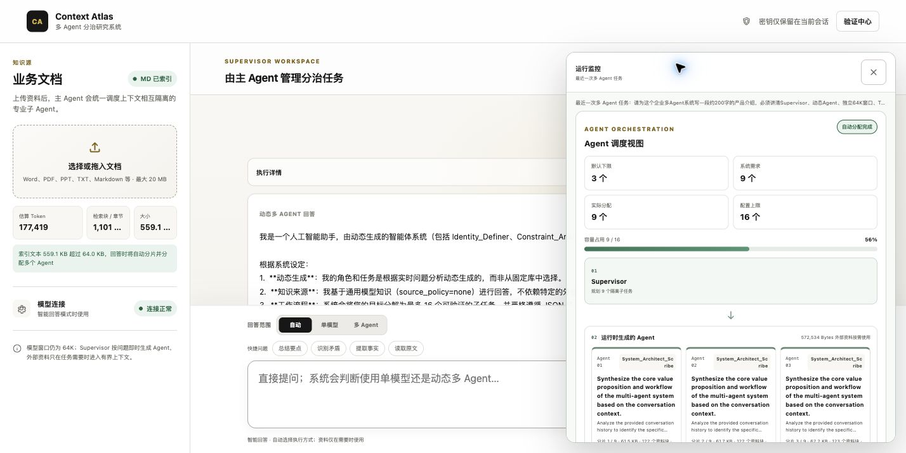
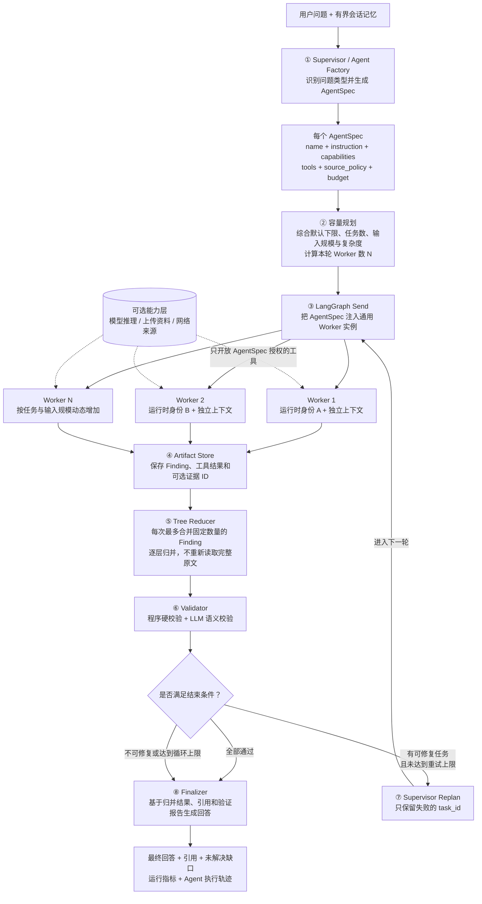
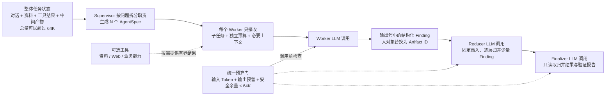

# Context Atlas

> 基于 LangGraph 的确定性多 Agent 系统，让固定上下文窗口的模型能够处理总体规模更大的复杂任务。

Context Atlas 建立在 OpenAI Chat Completions 兼容模型之上，采用主 Agent 动态生成执行 Agent、通用 Worker 隔离运行、窗口外状态、树形归并和 Validator 验证，在不修改底层模型的前提下扩展应用层任务容量。

系统突破的是**整体任务规模**，不是模型单次调用的物理上下文窗口。每次模型调用仍严格保持在原始限制以内。

## 为什么需要 Context Atlas

普通 Agent 往往把系统提示、对话历史、检索内容、工具结果和中间输出持续追加到同一个上下文：

```text
Context(t)
= System Prompt
+ Conversation History
+ Retrieved Content
+ Tool Results
+ Intermediate Outputs
```

随着任务持续执行，上下文会不断增长。达到模型上限后，系统只能截断信息、压缩历史或者终止请求。多个 Agent 如果继续共享同一条对话历史，也只会让上下文增长得更快。

Context Atlas 使用另一种协作方式：

```text
任意复杂问题
→ 识别问题类型
→ 动态生成 Agent 规格
→ 分配能力、工具和独立预算
→ 隔离执行
→ 分层归并
→ 结果验证
```

Agent 可以只使用模型原生推理，也可以按任务需要使用上传资料、网络来源或其他工具。外部资料不是运行 Agent Loop 的前提；所有 Agent 通过结构化结果、Artifact ID 和任务状态协作。

## 核心能力

| 能力 | 说明 |
|---|---|
| 基础模型能力 | 保留底层模型原有的理解、生成和推理能力 |
| 连续对话 | 追加保留每轮问题、回答、来源和执行指标，并向后续任务提供有界对话记忆 |
| 动态 Agent 生成 | 根据当前问题即时生成 Agent 名称、任务指令、能力、工具和来源策略 |
| 通用问题处理 | 无需上传资料即可使用多个隔离 Agent 完成分析、创作、规划、编程思路等任务 |
| 可选外部能力 | 按任务需要使用上传资料、网络来源或后续扩展的业务工具 |
| 长上下文任务 | 通过任务分治、有界输入和分层归并处理大规模信息 |
| 证据追踪 | 使用证据标识连接原始资料、中间产物和最终结果 |
| 质量验证 | 对结构、引用、完整性、冲突和语义一致性进行检查 |
| 容量治理 | 根据任务和资料规模自动分配 Agent，并为调用、分片和中间产物设置独立预算 |
| 来源可观察性 | 展示来源文件、索引文本、证据块的字节大小及其分片归属 |

## 主界面实测截图

以下截图来自主界面的真实运行，不是静态设计稿。测试时载入仓库内置的 `enterprise_research_128k.md`：索引文本约 559.1 KB、估算 177,419 Token、共 1,101 个资料块，整体规模明显超过单模型 64K 窗口。运行参数为默认至少 3 个 Agent、最多 16 个 Agent。

### 多 Agent 自动分配与独立窗口



右侧“Agent 调度视图”用于说明本轮任务如何被分治：

- **默认下限 3 个**：即使任务较小，系统也会保留最低并行数量；
- **系统需求 9 个**：Supervisor 综合任务规格、资料字节数和资料块数量计算本轮需求；
- **实际分配 9 个**：需求未超过配置上限，因此生成 9 个相互隔离的 Worker 实例；
- **配置上限 16 个**：防止 Agent 数量和模型调用数无限增长；
- **容量占用 56%**：表示本轮使用了 9/16 的可配置 Agent 容量，不是 Token 窗口占用率；
- **运行时生成的 Agent**：名称、目标、指令、能力和工具均由 Supervisor 针对当前问题生成，不来自预制业务角色表；
- **独立 64K 窗口 / 安全输入 61,000 Token**：每个 Worker 单独计算预算；64K 中预留 2,000 Token 输出空间和 1,000 Token 安全余量；
- **Tree Reducer 与 Validator**：Worker 完成后先分层归并，再进行硬规则和语义双层验证。

左侧同时显示了本轮资料规模和分片提示。完整资料仍保存在窗口外，Worker 只接收自己的任务、授权工具和预算内的分片，因此不会把 177,419 Token 一次塞入某个模型请求。

### LLM 回答与验证结果


第二张截图展示正常的 LLM 问答能力。该问题要求模型生成产品介绍，系统完成 16 次有界模型调用，并输出一段包含 Supervisor、动态 Agent、独立 64K 窗口、Tree Reducer 和 Validator 的回答。界面中的关键含义如下：

- **动态多 Agent 回答**：本轮经过 Supervisor 规划、Worker 执行和 Tree Reducer 归并，不是预制文本；
- **0 条来源**：本轮只使用模型原生生成能力，没有强制套用文档检索，说明 RAG 是可选工具而不是固定入口；
- **16 次模型调用**：统计本轮 Supervisor、Worker、Reducer、Validator 和 Finalizer 的有界调用总数；
- **Validator 通过**：硬规则与语义检查均通过后，Finalizer 才将回答交给用户；
- **177,419 Token 文档仍保持已索引**：窗口外资料可以继续存在，但不需要资料的 Agent 不会把全文塞进 Prompt。

这两张图分别证明了“如何分工”和“如何回答”：多 Agent 机制没有替代底层 LLM 的通用能力，而是在复杂任务中为它增加可控的任务分解、上下文隔离、分层汇总和验证闭环。

## 工作原理

### Agentic Loop 如何运作

这里的 Agentic Loop 不是让多个 Agent 自由对话，也不是在四种预制角色中进行路由。LangGraph 只固定控制骨架；Supervisor 根据当前问题即时设计执行 Agent，Validator 负责判断结果是否满足结束条件。


```mermaid
flowchart TB
    INPUT["用户问题 + 有界会话记忆"] --> S["① Supervisor / Agent Factory<br/>识别问题类型并生成 AgentSpec"]
    S --> SPEC["每个 AgentSpec<br/>name + instruction + capabilities<br/>tools + source_policy + budget"]
    SPEC --> P["② 容量规划<br/>综合默认下限、任务数、输入规模与复杂度<br/>计算本轮 Worker 数 N"]
    P --> D["③ LangGraph Send<br/>把 AgentSpec 注入通用 Worker 实例"]

    D --> W1["Worker 1<br/>运行时身份 A + 独立上下文"]
    D --> W2["Worker 2<br/>运行时身份 B + 独立上下文"]
    D --> WN["Worker N<br/>按任务与输入规模动态增加"]

    TOOLS[("可选能力层<br/>模型推理 / 上传资料 / 网络来源")] -. "只开放 AgentSpec 授权的工具" .-> W1
    TOOLS -.-> W2
    TOOLS -.-> WN

    W1 --> A["④ Artifact Store<br/>保存 Finding、工具结果和可选证据 ID"]
    W2 --> A
    WN --> A
    A --> R["⑤ Tree Reducer<br/>每次最多合并固定数量的 Finding<br/>逐层归并，不重新读取完整原文"]
    R --> V["⑥ Validator<br/>程序硬校验 + LLM 语义校验"]
    V --> G{"是否满足结束条件？"}

    G -->|"全部通过"| F["⑧ Finalizer<br/>基于归并结果、引用和验证报告生成回答"]
    G -->|"有可修复任务<br/>且未达到重试上限"| RP["⑦ Supervisor Replan<br/>只保留失败的 task_id"]
    RP -->|"进入下一轮"| D
    G -->|"不可修复或达到循环上限"| F

    F --> OUTPUT["最终回答 + 引用 + 未解决缺口<br/>运行指标 + Agent 执行轨迹"]
```

一次循环从 `Send` 开始，到 Validator 作出判定结束。Validator 通过时进入 Finalizer；验证失败时，只有存在可修复任务且尚未达到 `max_replans`，LangGraph 才把失败的 `task_id` 送回调度节点。已经通过的任务不会重复执行，原文也不会在 Agent 之间传递。

| 循环要素 | 系统中的具体含义 |
|---|---|
| 循环状态 | Task、Finding、Reduction、Validation、Iteration 和 Artifact 引用 |
| 循环动作 | 规划 → 并行执行 → 树形归并 → 验证 |
| 反馈信号 | Validator 返回的失败原因与可重试 `task_id` |
| 重试范围 | 仅重新调度失败任务，不重跑全部 Worker |
| 结束条件 | 验证通过、没有可重试任务，或达到最大重规划次数 |
| 确定性边界 | 跳转和循环次数由 LangGraph 条件控制，LLM 不能自行改变流程 |

### 为什么可以处理超过 64K 的整体任务

系统没有修改底层模型的 64K 上限，而是把“所有信息一次输入”改成“多个动态 Agent 的有界调用”。对话、资料、工具结果和中间产物的总量可以超过 64K，但任何单次 LLM 请求仍必须处于模型窗口以内。

每个 Supervisor、动态 Worker、Reducer、Validator 和 Finalizer 都拥有独立的64K物理窗口。系统不会把64K全部分给输入，而是统一保留2,000 Token输出空间和1,000 Token安全余量，因此界面显示的最大安全输入为61,000 Token。61K是上限而不是目标，简单任务仍只使用实际需要的上下文。


```mermaid
flowchart LR
    TASK["整体任务状态<br/>对话 + 资料 + 工具结果 + 中间产物<br/>总量可以超过 64K"] --> PLAN["Supervisor 按问题拆分职责<br/>生成 N 个 AgentSpec"]
    PLAN --> PACK["每个 Worker 只接收<br/>子任务 + 独立预算 + 必要上下文"]
    PACK --> WORKER["Worker LLM 调用"]
    TOOL["可选工具<br/>资料 / Web / 业务能力"] -. "按需提供有界结果" .-> PACK
    WORKER --> FINDING["输出短小的结构化 Finding<br/>大对象替换为 Artifact ID"]
    FINDING --> REDUCE["Reducer LLM 调用<br/>固定扇入、逐层归并少量 Finding"]
    REDUCE --> FINAL["Finalizer LLM 调用<br/>只读取归并结果与验证报告"]

    LIMIT["统一预算门<br/>输入 Token + 输出预留 + 安全余量 ≤ 64K"] -. "调用前检查" .-> WORKER
    LIMIT -.-> REDUCE
    LIMIT -.-> FINAL
```

关键点是将上下文按职责分散，而不是把多个 Agent 的内容重新拼回同一个大 Prompt。Supervisor 只管理 AgentSpec 和状态，Worker 不共享彼此历史，Reducer 只读取结构化 Finding，Finalizer 不接收所有执行过程；大对象、Artifact 和 LangGraph Checkpoint 始终位于模型窗口之外。图中的统一预算门同样应用于 Supervisor 和 Validator 等其他模型节点。

### 三条执行通道

系统根据任务复杂度、数据依赖和结果约束选择执行方式。

| 通道 | 适用范围 | 执行方式 |
|---|---|---|
| 基础模型通道 | 不依赖复杂编排、可由基础模型直接处理的请求 | 单模型有界调用 |
| 确定性工具通道 | 可通过规则、解析器或外部工具稳定完成的请求 | 确定性程序执行 |
| 动态多 Agent 通道 | 需要多个视角、任务分解、工具调用、归并或验证的复杂请求 | 运行时生成 AgentSpec，并进入受控 Agentic Loop |

简单任务直接处理，确定性任务优先使用工具，只有需要协作推理的任务才进入多 Agent 外循环。

### 主 Agent

主 Agent 同时是任务控制器和 Agent Factory。它只维护目标、动态 Agent 规格、任务表、执行状态、Artifact 引用和验证反馈。

```text
Supervisor Context
= Goal
+ Generated Agent Specs
+ Task Table
+ Execution Status
+ Artifact References
+ Validation Feedback
```

主 Agent 负责识别问题类型、为本次请求创建合适的 Agent、分配工具和预算、管理依赖并处理 Validator 反馈。输入规模增加时，主 Agent 的上下文不会随原始数据同步增长。

### 动态 Agent Factory

系统不存在 Fact、Analysis、Risk、Comparison 等固定执行角色。Supervisor 每次收到问题后都生成新的 `AgentSpec`，再由同一个通用 Worker 运行这些规格。

| AgentSpec 字段 | 含义 |
|---|---|
| `agent_name` | 针对当前问题生成的可读名称 |
| `agent_instruction` | 该 Agent 本轮必须遵守的任务指令 |
| `objective` | 边界明确、可独立验证的子目标 |
| `capabilities` | 当前问题需要的能力标签，不受固定角色枚举限制 |
| `tools` | 本轮真正允许使用的工具白名单 |
| `source_policy` | `none`、`optional` 或 `required`，决定是否依赖外部来源 |
| `input_budget` | 该 Agent 独立64K窗口中的最大安全输入预算，默认61,000 Token |

例如，代码设计问题可以生成“接口约束 Agent”“失败模式 Agent”“实现审阅 Agent”；运营规划问题则可以生成完全不同的职责。这些名称不是写死在代码中的模板。固定的是 Supervisor、Reducer、Validator、Finalizer 等控制职责，而不是业务执行角色。

动态 Agent 之间不共享完整消息历史，只交换结构化 Finding、Artifact ID 和状态信息。

### 窗口外记忆

原始资料、中间产物和验证报告保存在模型窗口之外：

```text
External Memory
├── Source Content
├── Parent Sections
├── Child Chunks
├── Evidence Records
├── Agent Artifacts
└── Graph Checkpoints and Validation State
```

模型上下文只作为当前任务的临时工作区。Agent 需要外部信息时，通过已授权工具和 Artifact ID 按需读取；不需要外部信息时直接使用模型原生能力。

### 有界会话记忆

用户界面将每轮问题、回答、来源和运行指标作为独立记录追加保存，不会用新结果覆盖旧结果。记录保存在浏览器本地存储中，并与模型上下文相互分离；后续请求只提取最近若干轮的有界视图，用于理解“这个”“上述内容”等对话指代。

单模型问答使用最近消息并执行 Token 预算裁剪。动态多 Agent 任务只接收最多固定字符数的对话记忆，并将其与外部事实来源分开。因此，可见历史能够持续积累，但进入任一模型调用的历史仍保持有界。

### 可选工具与有界来源

`model_reasoning` 始终可用。只有 AgentSpec 授权 `source_search` 时，Worker 才会访问已上传资料或预先取得的网络来源；`source_policy=none` 的 Agent 完全不依赖检索。

需要外部资料时，系统使用父子结构组织信息，并根据当前子任务构造固定大小的 Evidence Pack。检索是工具层的一种能力，不是系统的中心执行范式。

### 自动 Agent 分配与分片

系统设置默认 Agent 数量，小任务也会使用这一默认值完成交叉处理。规划出的 AgentSpec 数量、问题复杂度或外部输入规模增加时，主 Agent 会在最大 Agent 限制内自动增加 Worker；存在大规模资料时才进一步划分连续分片。

```text
Desired Agents
= max(
    Default Agents,
    Source Bytes / Shard Byte Target,
    Chunk Count / Chunk Target,
    Task Complexity,
    Planned Agent Specs
  )

Allocated Agents = min(Desired Agents, Max Agents)
```

对于不使用外部资料的任务，Worker 按不同 AgentSpec 独立求解；对于需要完整扫描资料的任务，系统使用更小的目标分片。两种情况最终都只向 Reducer 传递结构化 Finding，不传递完整执行上下文。

### 树形归并

如果一次性合并全部子任务结果，归并阶段仍可能形成过大的 Prompt。系统使用固定扇入的树形 Reducer 分层压缩：

```text
Layer 0: A1  A2  A3  A4  A5  A6
           \ /      \ /      \ /
Layer 1:   B1       B2       B3
               \    |    /
Layer 2:          C1
```

任务规模增加时，系统增加归并层数，而不是扩大单个 Reducer 的上下文。

### 双层 Validator

Validator 将确定性规则和语义判断分开处理。

**硬规则验证**由程序执行，检查结构契约、必要字段、证据引用、任务状态、上下文预算和循环边界。

**语义验证**由模型执行，检查目标覆盖、证据支持、矛盾遗漏和不确定性表达。

模型判断不能覆盖硬规则结果。只有硬规则与语义验证均满足要求，任务才进入最终输出。

### 有界 Agentic Loop

```text
Plan
→ Execute
→ Reduce
→ Validate
→ Pass: Finalize
→ Retryable Gap: Replan Selected Tasks
→ Loop Limit: Stop
```

Validator 可以将可修复缺口返回给主 Agent，但重规划只针对失败子任务。循环受状态机、最大轮数和上下文预算约束，不会无限自主运行。

## 如何突破上下文瓶颈

设底层模型单次上下文上限为 `L`，第 `i` 次调用的输入、预留输出和协议开销分别为 `Iᵢ`、`Oᵢ` 和 `Hᵢ`。系统始终保证：

```text
Iᵢ + Oᵢ + Hᵢ ≤ L
```

任务资料总量 `D` 可以大于模型窗口：

```text
D > L
```

系统通过任务分治，让所有实际调用继续满足：

```text
max(Iᵢ + Oᵢ + Hᵢ) ≤ L
```

实现这一目标依赖八个机制：

1. **任务分解**：Supervisor 将整体目标拆成可独立验证的子任务；
2. **动态生成**：每个子任务获得针对当前问题生成的 AgentSpec；
3. **有界工具结果**：只有需要外部能力的 Agent 才接收预算内的工具输出；
4. **隔离**：动态 Worker 不共享无限增长的消息历史；
5. **外部记忆**：原文和中间产物不保存在模型上下文中；
6. **有界会话记忆**：界面历史保存在模型窗口之外，后续调用只接收预算内的最近对话；
7. **树形归并**：大量结果通过固定扇入逐层合并；
8. **预算控制**：每次调用在执行前检查 Token 和序列化字节规模。

因此，系统扩展的是模型可完成的整体任务规模，而不是模型一次能够读取的物理窗口。

## 设计原则

1. **模型能力与流程控制分离**：模型负责语义处理，程序负责状态、边界和停止条件。
2. **原文与工作上下文分离**：完整信息保存在窗口外，模型只读取当前任务所需内容。
3. **动态实例相互隔离**：运行时生成的 Worker 不共享无限增长的对话历史。
4. **可见历史与模型历史分离**：界面可以保留完整轮次，模型只接收经过预算裁剪的最近记忆。
5. **按需工具调用代替能力绑定**：上下文和工具由 AgentSpec 动态构造，而不是默认依赖检索。
6. **分层归并代替一次汇总**：任务规模增长通过增加层数吸收，不扩大单次 Prompt。
7. **结构化状态代替自由群聊**：Agent 通过任务、Artifact 和证据 ID 协作。
8. **程序验证优先于模型判断**：确定性约束由代码执行，语义质量再由模型评估。
9. **重规划必须有界**：只修复可恢复问题，并限制最大循环次数。
10. **简单任务保持简单**：不需要协作的请求不进入多 Agent 流程。
11. **准确表达能力边界**：突破整体任务容量不等于修改模型物理上下文上限。

## 能力边界

Context Atlas 不能让底层模型在一次请求中读取超过自身物理窗口的内容。多 Agent 协作会增加调用次数、执行延迟和系统复杂度；当任务选择使用外部资料时，分块和来源质量也会影响最终结果。

系统通过父子索引、证据引用、冲突保留、树形归并和 Validator 降低这些风险。它的核心价值是在明确边界内，以可控、可追踪的工程结构扩展任务容量和结果可靠性。
